从江西返程的当晚，在熟悉的烤肉王店里，与挚友们一拍即合，定下了这场说走就走的旅行。马不停蹄收拾行囊，两天后的1月22日，我们便奔赴北京——一头扎进京城凛冽的冬日晚风里，这趟旅途，也从这一刻正式落笔。

抵达北京时，机场的暖气裹着暖意扑面而来，恍惚间竟像还置身深圳；辗转至积水潭地铁站出站，阳光明晃晃地洒下来，寒风却猝不及防地扑在脸上。出租车司机操着一口地道的京腔，去往酒店的途中途经雍和宫，道路横平竖直，路旁未化的积雪在阳光下泛着微光，褪去绿意的树木旁站着各式店铺，行人熙攘，烟火蒸腾，这便是北京赠予我的第一帧鲜活印象。

---

## 第一站：钟楼、什刹海、南锣鼓巷
安顿妥当后，我们径直奔向老北京烟火最浓的片区，将第一站留给钟楼、什刹海与南锣鼓巷，沉浸地触摸京城的市井温柔。

最先走到钟楼，灰砖砌筑的古楼矗立在街巷尽头，厚重又古朴，来往的游人大多举着糖葫芦拍照打卡，热闹又有氛围感。比起钟楼本身，更让我印象深刻的是楼下一位卖糖葫芦的大爷，坐着轮椅守着小摊，还饶有兴致地和路人猜谜语，说好答对就免费送一串，答不对就买一串图个热闹。我们凑过去试了一次，没能猜中，乖乖买了一串，酸甜的山楂裹着脆亮的糖衣，真不赖，不甘心又试了一次，这下又多了一串。
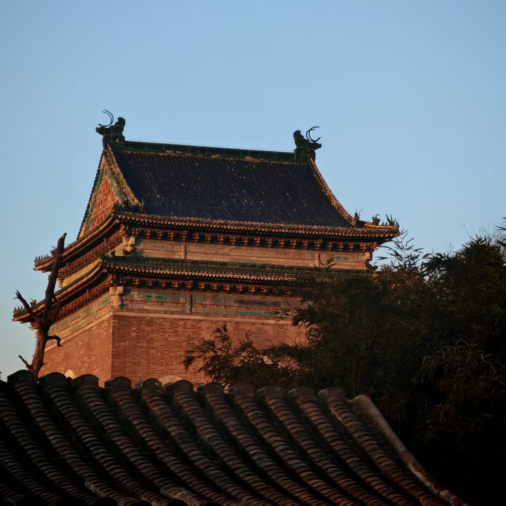

循着地图往什刹海走，穿过窄窄的胡同，不经意间拐过一个小口，一片白茫茫的冰面突然映入眼帘，这就是冬日的什刹海。湖面一半结了厚厚的冰，既有水波潋滟，又有几分静谧清冷，夕阳刚好悬在光秃秃的树梢间，把天边染成橘粉与淡蓝交织的颜色，光影落在冰面上，美得干净又纯粹，站在岸边看了许久，都觉得挪不开脚步，寒风拂面，也挡不住这份落日冰湖的绝美。
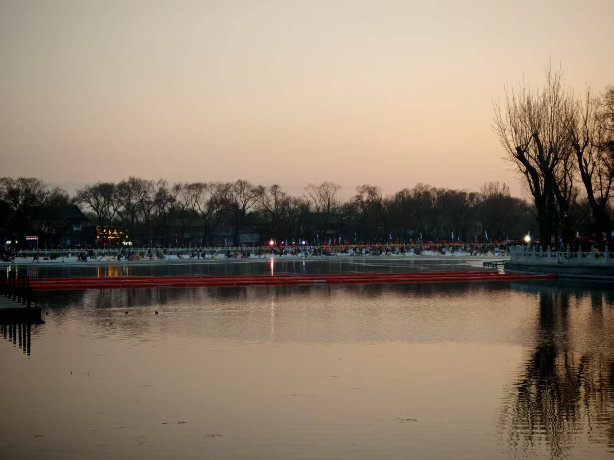
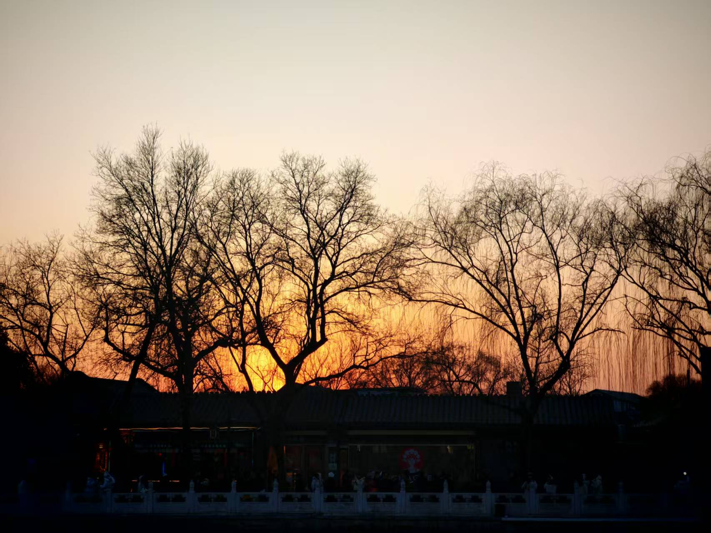

顺着胡同晃到南锣鼓巷，从巷口一眼望不到尽头，青瓦灰砖的老胡同里，藏着数不清的小店与小吃，烟火气扑面而来。空气里飘着糖葫芦的甜香、老酸奶的醇香，还有各类小吃的香气，买一杯冰镇老北京酸奶，边走边慢悠悠闲逛，看街边琳琅满目的文创小店，听着巷子里的人声喧闹，完全放慢了脚步，沉浸式感受老北京胡同的韵味。
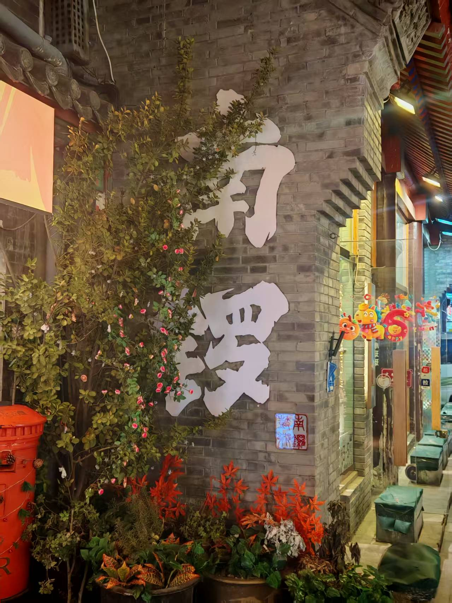

逛至天色渐晚，寒意愈浓，我们钻进胡同里一家铜锅涮肉店。铜锅烧得炭火通红，汤汁咕嘟咕嘟翻滚，鲜嫩的羊肉涮熟后裹满浓香麻酱，一口下肚，暖香从舌尖漫遍全身，浑身寒意瞬间消散。这一口热乎的京味涮肉，成了首日京城之行最踏实的慰藉。

---

## 第二站：故宫
次日一早奔赴故宫，提前做好了路线攻略，从东华门缓步走向午门，沿途少了些喧闹人流，反倒能静下心感受皇城的静谧。刷身份证入园，踏过金水桥的刹那，朱红宫墙与明黄琉璃瓦直直撞进眼底；冬日的晴空澄澈透亮，将琉璃瓦衬得愈发熠熠生辉。
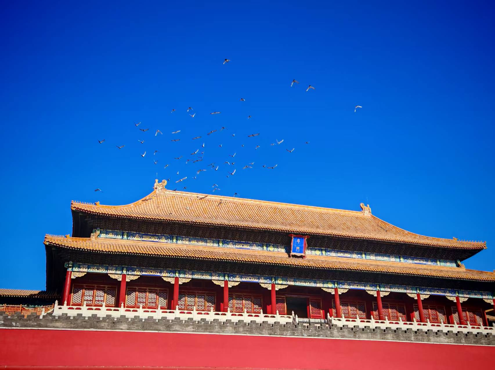

沿着中轴线慢慢走，站在太和殿的台阶下面抬头望，飞檐翘角里藏着六百年的威严，连风都似染上了庄重。
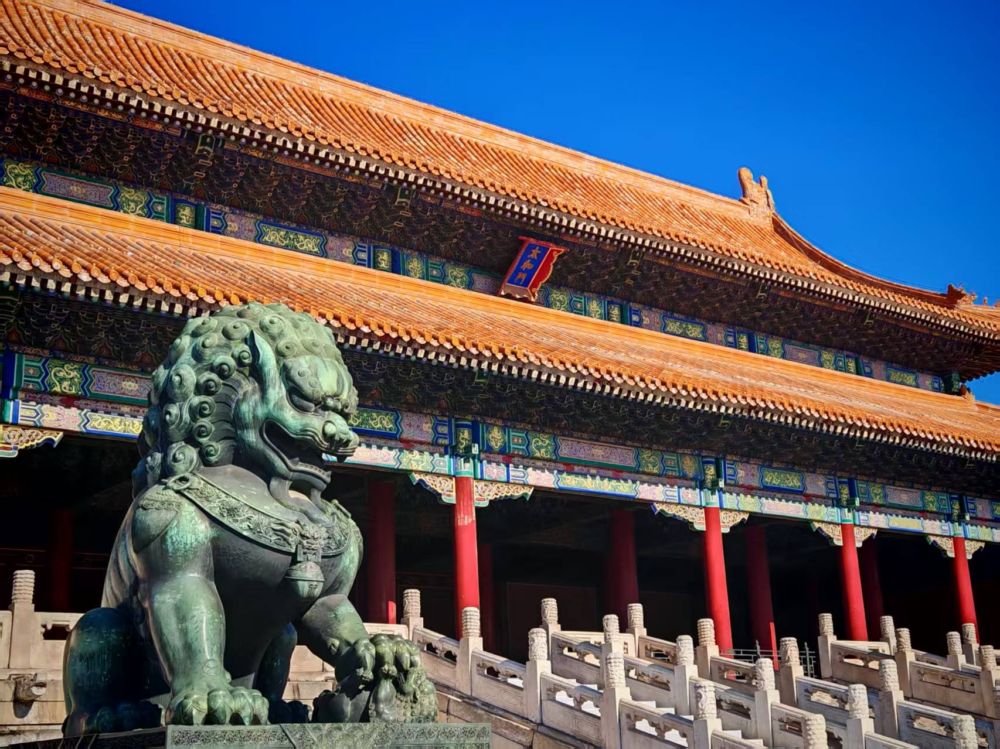

故宫各处的檐角走兽雕塑排列整齐，形态各异、栩栩如生，藏着古人精湛的工艺巧思。
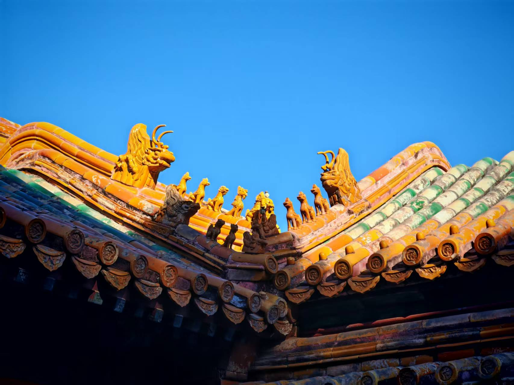

走到偏殿的宫道里，少了几分喧闹，多了几分清幽。伸手轻抚朱红宫墙，指尖能触到岁月打磨的粗糙纹理，墙皮带着些许斑驳痕迹，风卷着枯叶掠过青石板路，沙沙作响，恍惚间，仿佛能听见旧时宫墙内的细碎声响。
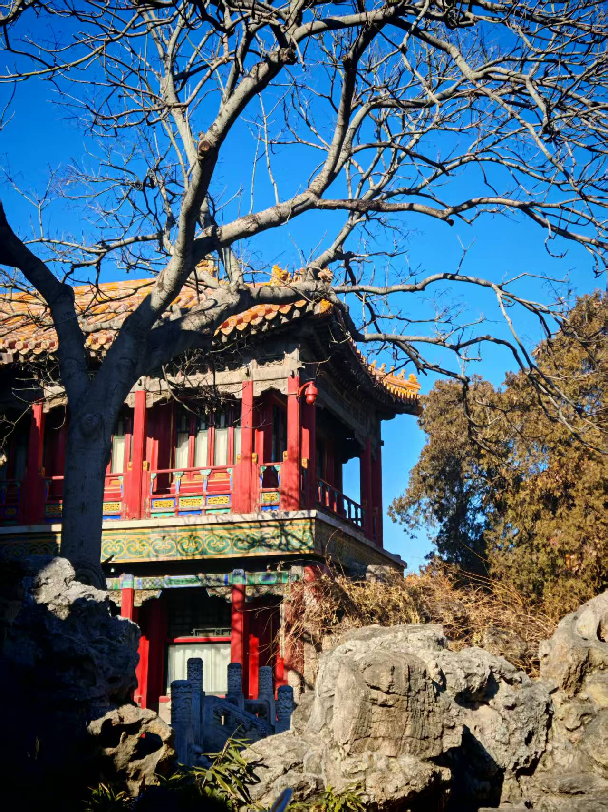

逛至御花园，景致又是另一番模样，园内奇石假山错落有致，古树枝干苍劲，虽冬日无叶，却别有风骨。阳光透过枝桠缝隙，在地面与楼宇间洒下斑驳光影，绕着假山慢慢踱步，看亭台楼阁掩映其间，一砖一瓦、一草一木，都藏着紫禁城独有的温柔与厚重。

---

## 第三站：王府井&天坛
本想逛完故宫打车去紫光园吃烤鸭，结果听信了出租车司机的话，被骗到胡同里一家价格虚高、评分平平的馆子。吃一堑长一智，只得重新打车，也算是在北京学会了下午三四点吃午餐。主打一个能忍，几个广东的来了这里之后早茶变成了下午茶，晚上再补一个夜宵，也算是一日三餐没毛病。
紫光园的烤鸭皮脆得一碰就碎，卷上葱丝黄瓜丝，再抹一层甜面酱，一口下去，油脂香混着面香，嘿，那叫一个地道。满满一桌菜，一整提酸奶，两个小甜点，一人一杯奶茶，吃得那叫一个酣畅淋漓。
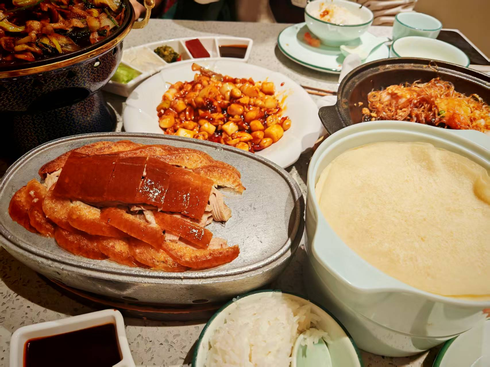

晚上打车赶往天坛公园，抵达时天色刚好擦黑，暮色沉沉的。我们顺着园内的大道一路往前走，路灯伴着路边光秃秃的树木，氛围感慢慢拉满。
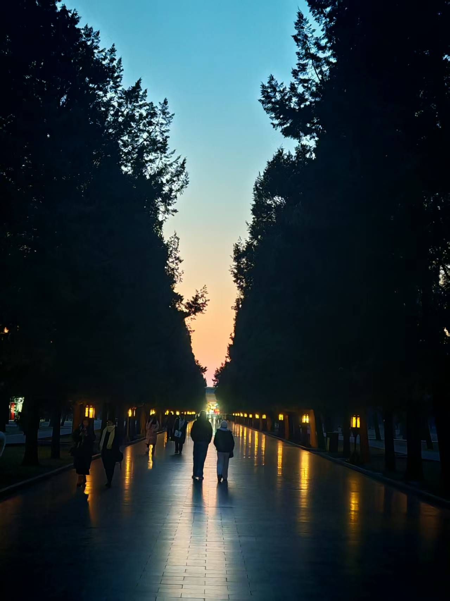

等一路找到祈年殿所在的区域，天已经彻底黑透，园区也到了闭园时间，只能止步在外，没法进入近距离观赏。我们就站在围栏外，远远望着夜色里的祈年殿，殿身被灯光尽数点亮，深蓝色的殿顶搭配暖金色的灯光，在漆黑的夜空里格外耀眼，层层叠叠的殿宇轮廓精致大气，即便只能远观，也能感受到它独有的庄严与震撼，隔着距离看这一抹光辉，反倒成了别样的记忆。
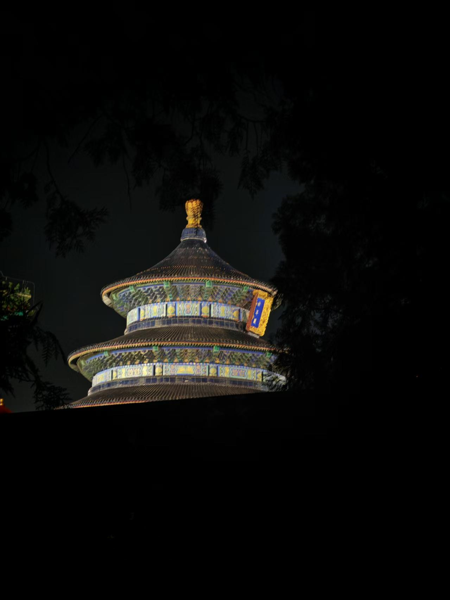

---

## 第四站：国家博物馆&天安门广场
上午泡在国家博物馆，我们在底层的历史展厅里慢慢逛。每一件文物都沉淀着岁月：镇馆的司母戊鼎古朴厚重，四羊方尊造型精巧，隔着玻璃都能感受到千百年前的工艺底蕴；还有那顶引得无数人打卡的蓝色凤冠，珠翠琳琅、纹样精致，静静陈列在展柜中，无声诉说着过往。
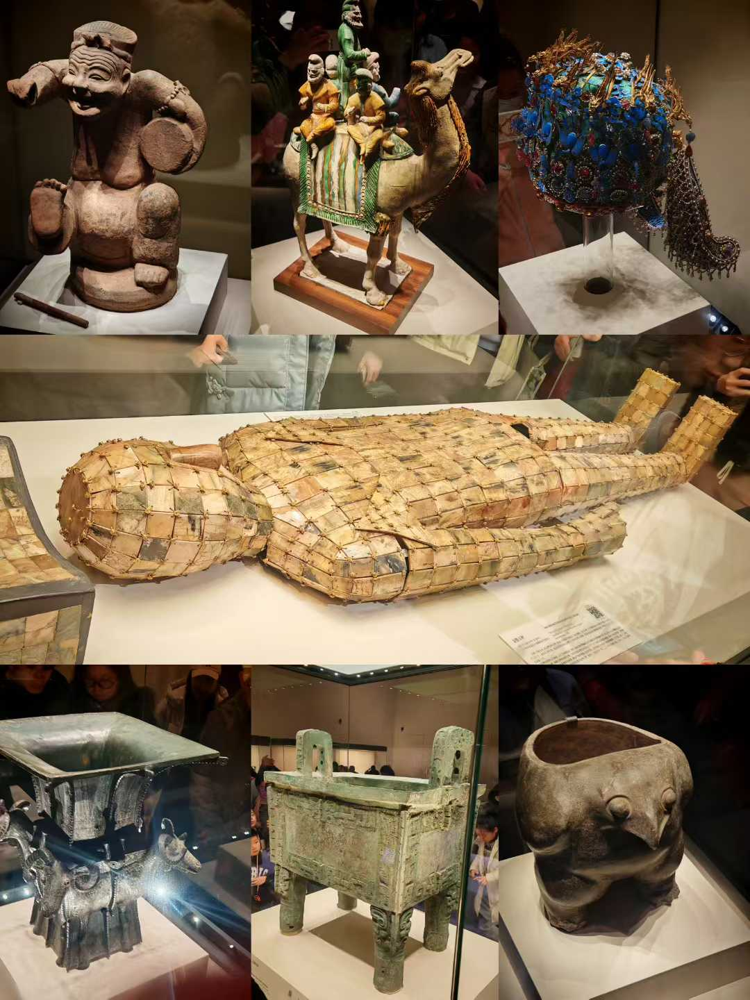

那些书上见过的名字，此刻真切摆在眼前，心底的震撼难以言说。好像顺着时光长河走了一遭，慢慢读懂了华夏大地的脉络。

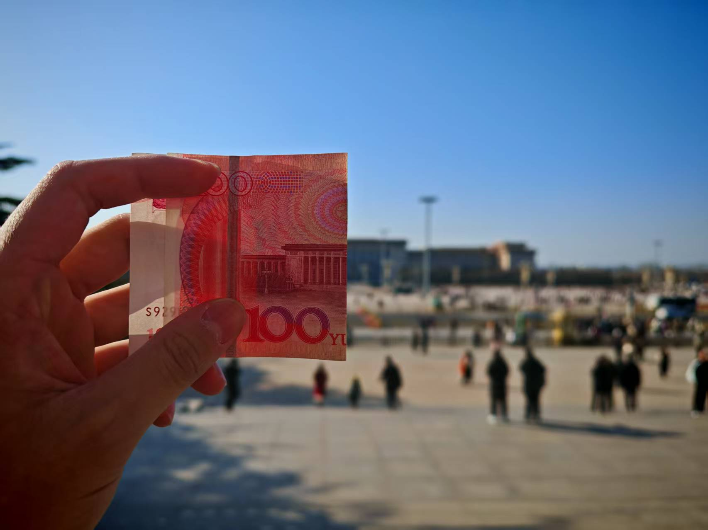

走出国博，便是天安门广场。站在广场上，瞬间觉出自身的渺小：五星红旗迎风飘扬，人民英雄纪念碑在阳光下肃穆矗立。我们立在栏杆外，看着往来行人，家国情怀在心底翻涌，格外真切。
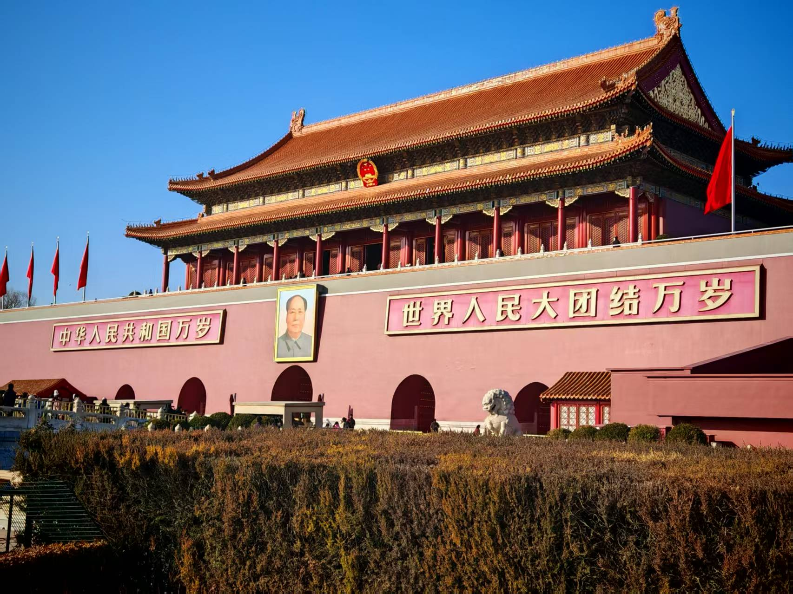

在天安门城楼前找好角度拍照留念，迎着风，将这一刻定格。

---

## 第五站：雍和宫&地坛
下午走进雍和宫，一进门便被缭绕的香火包裹。红墙金顶的藏式建筑在阳光下格外耀眼，虔诚的香客双手合十祈福，我们也跟着拜了拜；斑驳的古柏在风里轻轻摇晃，身处其中，心瞬间静了下来。可惜来得稍晚，法务处刚关了门，只能请到香，却没能买到心心念念的手串。
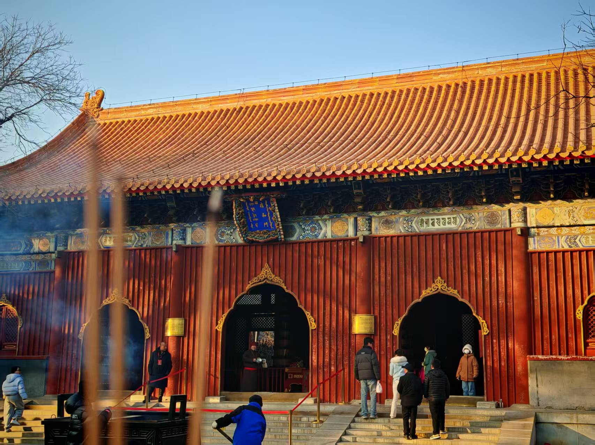

晚上在地坛，公园里面路灯比较少，暗沉沉的光线别有一番风味。冬日的树林落尽了叶子，透着淡淡的萧瑟，却藏着老北京独有的市井气。大路两旁的树上都用毛线和玩偶做了各样的装饰，那是人们给树织的衣服。
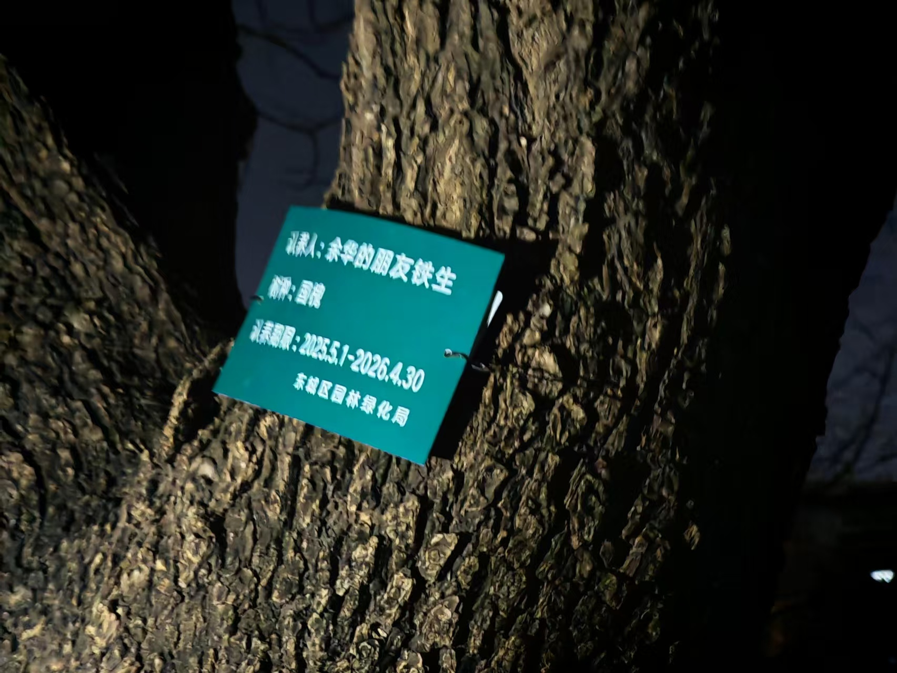
我们找到了余华与史铁生的树，也不由得想起史铁生在《我与地坛》里写的：“在满园弥漫的沉静光芒中，一个人更容易看到时间，并看见自己的身影。”史铁生的文字之所以成为经典，从不是无病呻吟，而是一个在生死边缘挣扎过的人，用生命换来的真理。时隔多年，这些文字依旧能给人源源不断的力量。

---

## 第六站：圆明园&颐和园
北京之行的最后一天，先去了圆明园。冬日里的断壁残垣更显苍凉，大水法的遗址静静伫立在那里，斑驳的石头刻着岁月的痕迹，我们摸着断裂的石柱，听着旁边的导游讲过去的故事，心里皆是沉重，那些历史，终究要刻在心里。
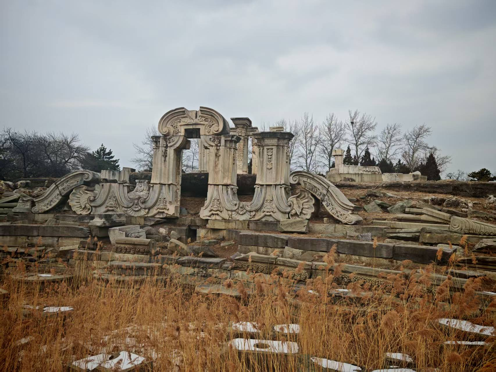

随后去往颐和园，往昆明湖的方向走，一路上偶遇不少猫咪。穿出小路，昆明湖豁然展现在眼前，视野瞬间开阔：“画中游”的长廊延伸向远方，每段梁上都绘着不同的图景；远处湖面结着厚冰，冰面上挤满了人，滑冰的队伍排了老长。十七孔桥横卧在冰面上，我们数着桥洞慢慢走，佛香阁在远处山巅巍峨耸立。漫步长廊，看斑驳的彩绘，听风穿过树林，一步一景，皆是皇家园林的大气与精巧，仿佛踏入了百年前的旧时光里。
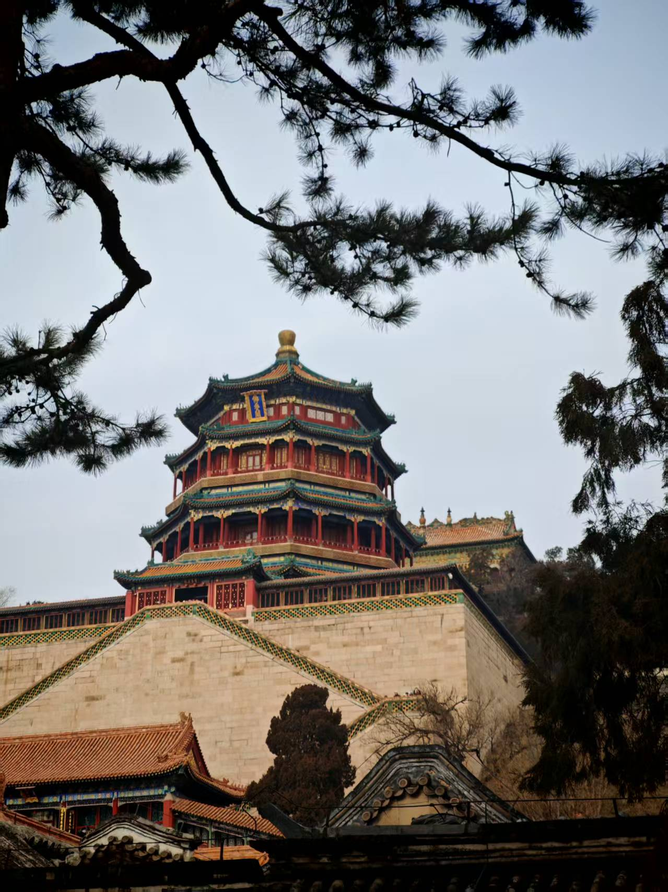

---

## 尾声
离开北京的傍晚，风仍带着京城的凛冽，心里却装着满当当的回忆。从红墙黄瓦的庄严，到胡同巷陌的烟火；从历史的厚重，到市井的温柔，这趟一月的京城之行，藏了太多难忘的瞬间。

这趟奔赴，不只是看风景，更是与首都对话，与自己相遇。京城的风，吹过红墙，也吹进心底；这场旅行的故事，会永远留在记忆里。而前路漫漫，下一场奔赴，已在路上。

（撰稿：2026/3/23）