1月25日午后，暂别京城的红墙黄瓦，我们一路奔赴天津，冬日的风里，城市的味道悄然变换，一场藏着洋楼烟火与海河温柔的津门之行，就此开启。

## 初遇津门：街角小馆，藏着地道津味
抵达天津时恰逢晚饭饭点，奔波一路的疲惫，被对本地美食的期待一扫而空。带着行李便在酒店旁寻了家小巧的本地餐馆，不曾想竟邂逅了意料之外的美味。老醋六样酸甜解腻，牛窝骨炖得软烂入味，当地特色的粑粑扎实饱腹，最奇妙的是那道茄子做的菜，被做成薯条的模样，炸得酥酥脆脆，外焦里嫩，咬开后还带着茄子的绵软，口感别致。一桌家常滋味，暖胃又暖心，也让我们对这座城市的烟火气，多了几分欢喜。
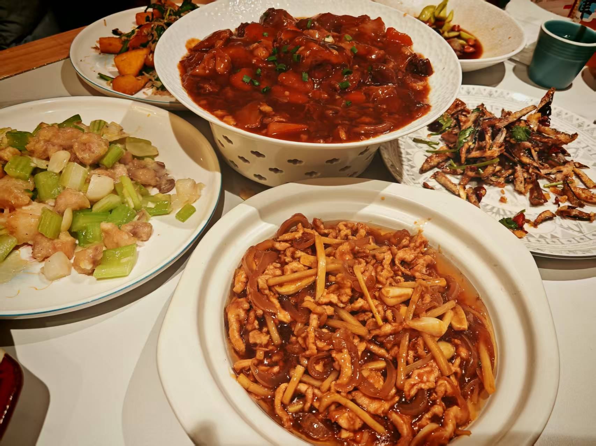

休整了当晚与次日一早，慢下来的节奏，恰适合感受天津的松弛，待午后阳光正好，我们便动身开启津门漫步。

## 第一站：五大道——洋楼间，听马蹄踏过百年时光

午后的第一站，直奔五大道。这里没有密集的高楼，只有错落排布的英式、法式、意式、西班牙式老洋房，一栋挨着一栋，风格各异却又浑然相融，砖红的墙面、复古的拱门、精致的雕花、别致的窗棂，每一处细节都藏着百年前的精致与浪漫，走在其间，仿佛踏入了一座露天的近代建筑博物馆，一步一景，皆是风情。
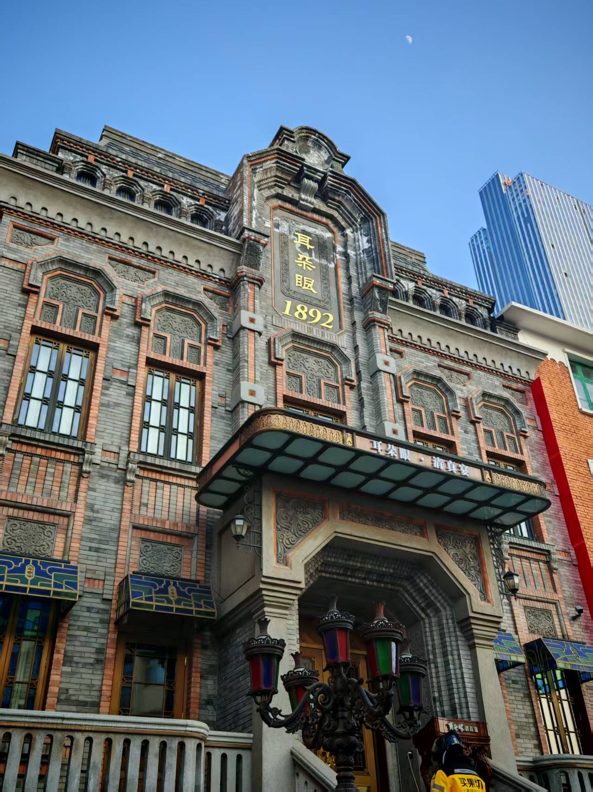

路上偶有复古马车缓缓驶过，棕色的骏马踏着沉稳的步伐，马蹄声叮叮当当，清脆悦耳，敲碎了街巷的安静，也让时光仿佛慢了下来。马车驶过洋楼旁，与周围的复古景致相映成趣，恍惚间竟有种穿越回百年前的错觉，引得我们频频驻足，望着马车远去的背影，久久回味。
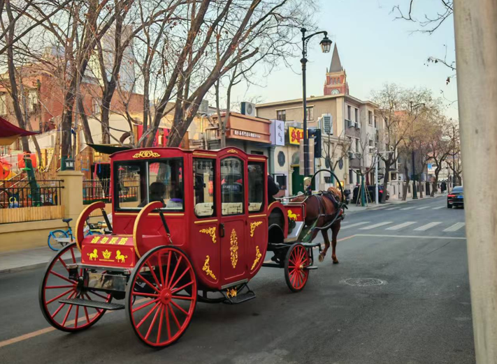

行至五大道广场，眼前的景致格外有感觉。中间是一片开阔如操场的空地，冬日里虽少了人群聚集，却更显通透；四周清一色的黄红色洋楼围成一圈，暖黄的墙面在冬日阳光下泛着温柔的光，复古的建筑风格搭配开阔的空间复古又雅致。
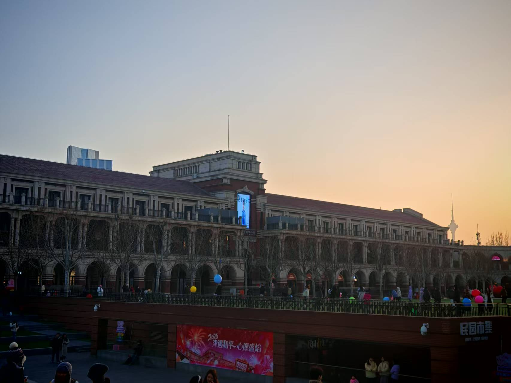

逛到街边小店，挑了一枚西开教堂的冰箱贴作纪念，而后便循着路，步行前往下一站西开教堂。路上钻进福彩店，一人一张刮刮乐，居然都中了，突如其来的幸运~
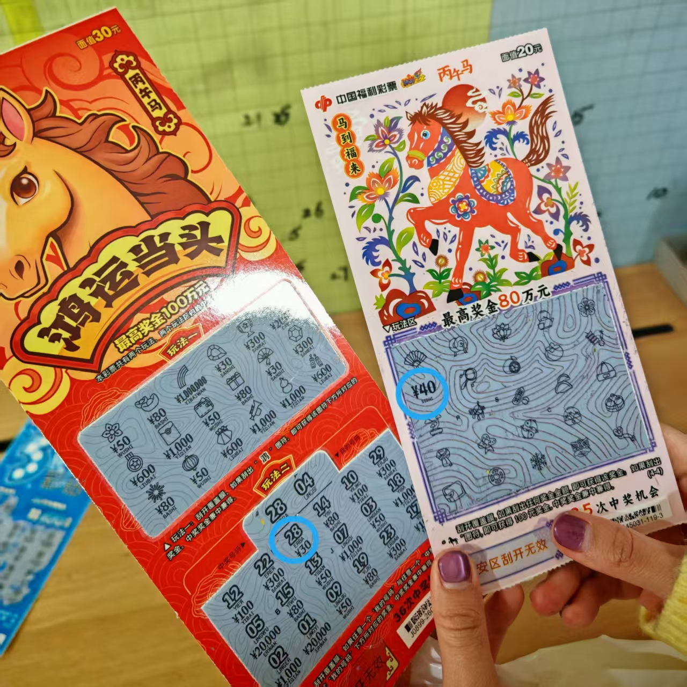

## 第二站：西开教堂&滨江道步行街——光影里的静与闹

傍晚抵达西开教堂时，夜色初临，灯光恰好点亮了教堂外立面。红墙配墨绿穹顶，在暖光映衬下多了几分温柔，少了几分肃穆，静静伫立在街头，成了最亮眼的风景。

教堂对面，便是一眼望不到头的滨江道步行街，从街头走到街尾，一路满是热闹。街边小摊鳞次栉比，美食香气扑面而来，糖葫芦最低两三块钱一串，小摊前总能看到长长的队伍；五元店、十元店随处可见，购物、小吃一应俱全。还偶遇了狗不理包子总店，望着古色古香的门头，也算打卡了天津的标志性味道。
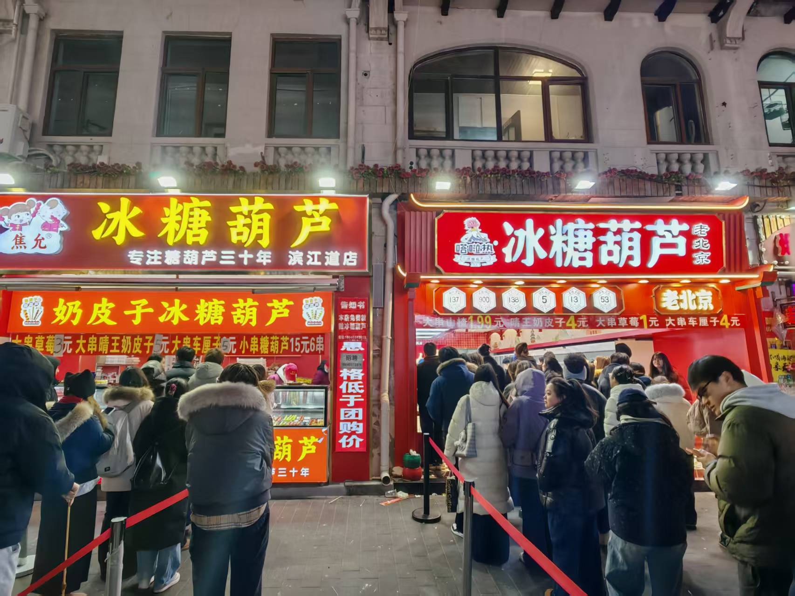

偶遇天津特色的海河牛奶，之前真没听过这牌子，但是一喝实在很惊喜——后来又回头买了好多，直到撰稿时，我还在享用这份味道。第一次见牛奶能做出这么多口味，各种风味像把世界各地的奶茶装进了袋里，牙咬开口就能喝，方便又美味。
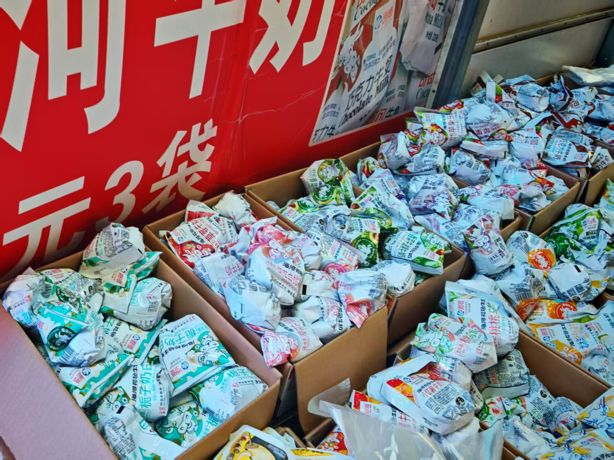

走累了便钻进街边餐馆，点上天津特色的八珍豆腐，嫩白的豆腐吸饱了鲜美的汤汁，入口即化，搭配着虾仁、鱿鱼、香菇等等，鲜味儿层层叠叠，再来上一盘酸甜适口的糖醋里脊，一口津味，尽是满足。
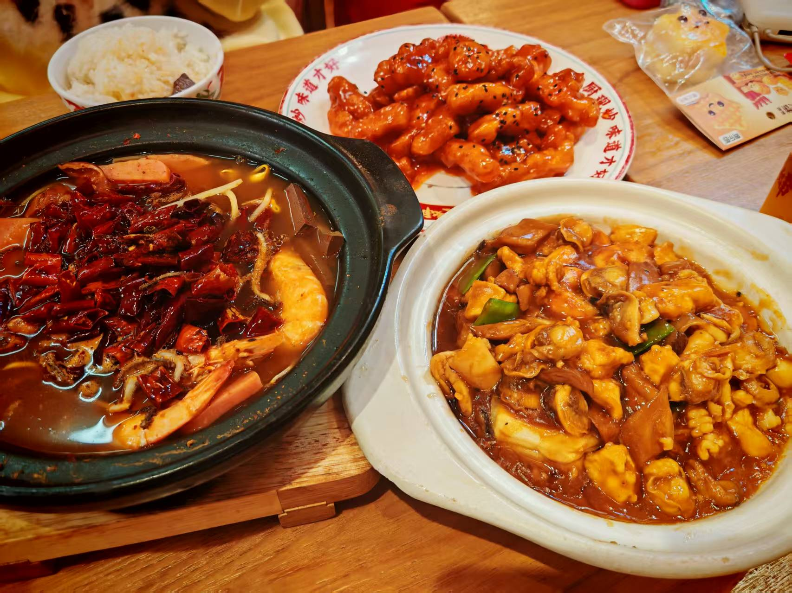

## 第三站：世纪钟广场&意式风情街——骑上小电驴，逛遍津门风情
第三天，借着同伴的小电驴，我们解锁了天津的逛吃最佳方式，跟着地图的路线一路慢悠悠骑，风从耳边轻轻吹过，看街边的洋楼与绿树匆匆掠过，骑到一处喜欢的景致便停下打卡，逛够了再往下一个地方走，不用赶行程，不用挤人群，我最喜欢这种自在又惬意的感觉。

第一站先骑到世纪钟广场，远远便望见那座造型独特的世纪钟，立在海河旁格外醒目。走近了看，更是惊叹于它的精巧，钟体上的雕塑满是工业复古气息，齿轮、纹路的设计细节拉满，更有趣的是钟身还刻着 12星座的图案，精致又别致，钟摆轻轻晃动，仿佛在为这座城市默默记录着每一寸时光。广场旁便是天津站，带着岁月沉淀的历史感，红墙建筑与世纪钟相映成趣，复古又有韵味。
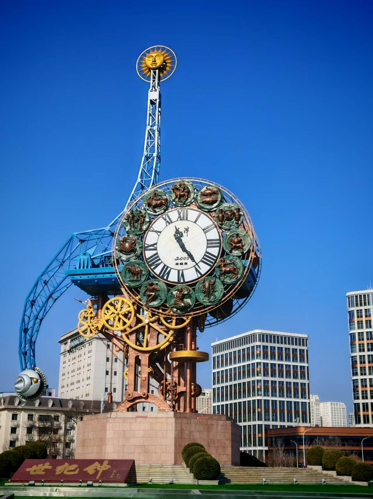

一路骑行至意式风情街，浓郁的异国风情扑面而来。拱形走廊、铁艺路灯、雕花洋楼、精致的广场喷泉，每一处景致都透着纯正的意大利风格，冬日的阳光温柔地洒在暖黄色的建筑墙面上，光影斑驳，仿佛一秒踏入欧洲街头。

沿途还偶遇了不少风格各异的小洋楼，复古的红砖洋楼、清新的白色洋房，与周边现代的玻璃幕墙建筑隔空相望，复古与现代的建筑风格碰撞出别样的美感，走在其间，仿佛在时光里穿梭，一边是百年的历史底蕴，一边是鲜活的现代生活。
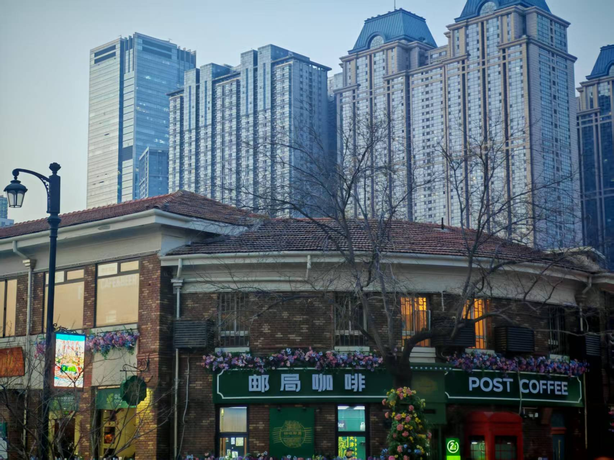

## 第四站：天津之眼——摩天轮下的限定浪漫
一路向前，循着海河的方向，远远便望见天津之眼横跨河面的身影，巨大的摩天轮在冬日的晴空下静静伫立，简约的造型却自带大气与震撼，成了海河旁最亮眼的地标。摩天轮下的河道结了厚厚的冰，冰面上聚满了成群的红嘴鸥，或低头啄食，或振翅轻跳，叽叽喳喳的声响，为这冰面添了几分鲜活的生气。
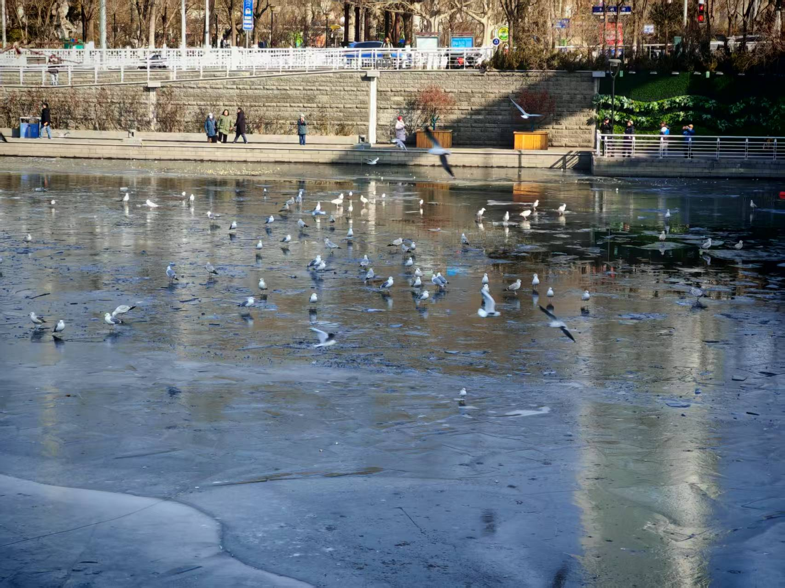

我们在摩天轮下打卡拍照，看红嘴鸥时而驻足冰面，时而集体盘旋，翅膀扇动的模样，像在冰面上掀起了层层“海浪”，忽而聚拢忽而散开，场面格外壮观，我们站在原地，望着这突如其来的美好，连呼吸都不自觉放轻。吹着微凉的海河晚风，看摩天轮静静转动，听冰面鸟儿的轻鸣，所有的美好都恰到好处。
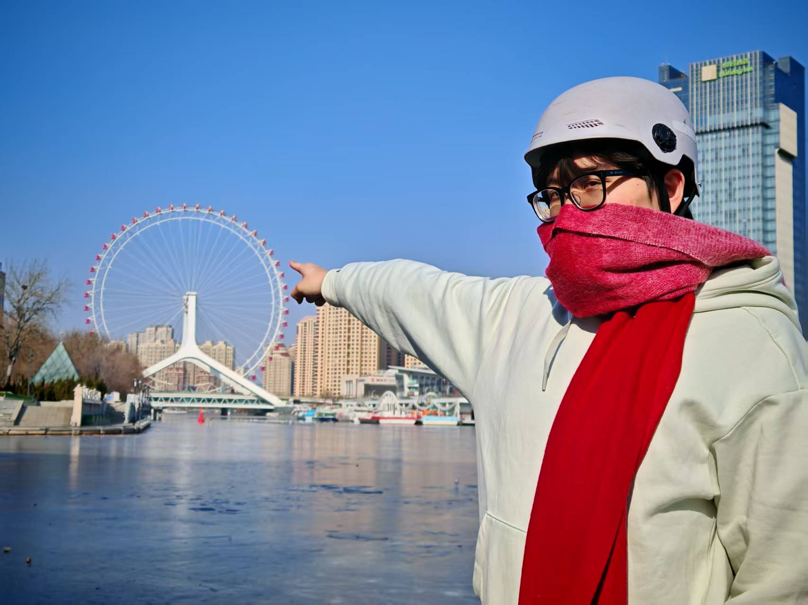

## 尾声：津门温柔，最是人间烟火
从京城到津门，不过短短一程，却邂逅了全然不同的城市模样。

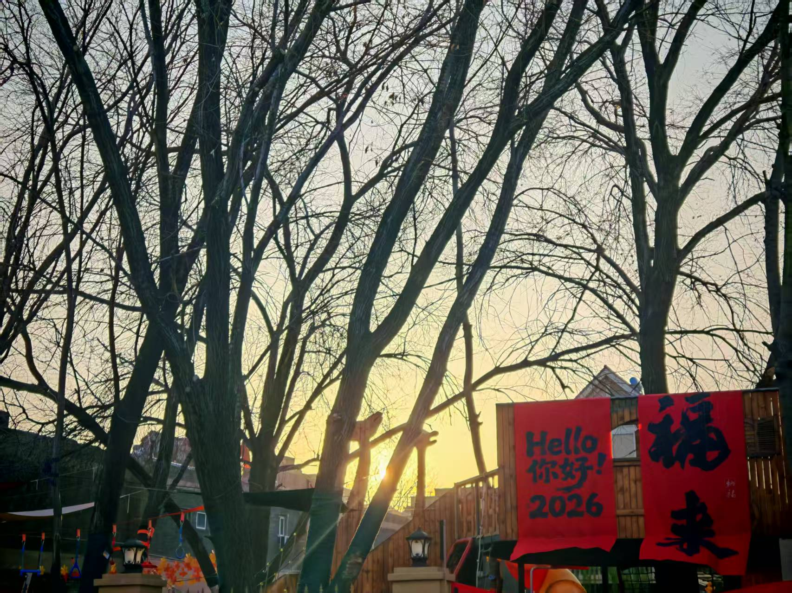

这座城市从不会用气势打动你，却会用一点一滴的美好，悄悄住进心里。街头巷尾随处可见的美味，从街角小馆的老醋六样、酥炸茄子，到滨江道的糖葫芦、百种口味的海河牛奶，再到鲜掉眉毛的八珍豆腐，每一口都是扎实的市井滋味，暖胃又暖心；遇到的每一个天津人，说话都带着爽朗的随和，问路时的耐心指引，小店老板的热情推荐，都让这座城市的温度，在冬日里愈发浓烈。

这里的天很蓝，风很轻，洋楼藏着历史，海河载着温柔，街头巷尾的烟火气，裹着最踏实的生活模样。天津从不是一座需要匆匆打卡的城市，而是一座适合慢慢走、细细品的城市，适合骑着小电驴穿梭在洋楼街巷，适合坐在海河旁吹吹晚风，适合在街边小馆尝一口地道津味，适合把时光浪费在所有美好的事物上。

（撰稿：2026/3/23）