从津门的洋楼烟火中抽身，1月27日晚，我们一路奔赴山西，第一站落脚大同。车子驶入这座北方古城时，夜色已浓，城市的灯光在冬日的夜色里铺展开来，带着塞北独有的沉稳。我们住进大同南站旁的酒店，推开窗便能清晰望见车站的轮廓，简单收拾完行囊，满心都是对次日北岳恒山的期待——这是我们打卡的最后一座五岳，集齐五岳的心愿近在咫尺，激动的心情让这个夜晚都变得格外热闹。一场跨越大同、太原的三晋之旅，便在这份满心的期待中，正式拉开序幕。

---

# 第一部分：大同——五岳之雄，石窟之壮，滑雪之乐
## 第一站：北岳恒山&悬空寺
天刚蒙蒙亮，天边还泛着淡淡的晨雾，我们便迫不及待收拾行囊出发前往北岳恒山。车子一路向北，路况格外平整，道路两旁立着排排高大笔直的落叶乔木，冬日里落尽了叶子，光秃秃的枝桠遒劲地伸向天空，勾勒出简洁的线条。道路两侧是略带荒芜的北方土地，褐黄色的土地上覆着薄薄的霜，远处工业区的轻烟袅袅升起，在晨风中慢慢散开，勾勒出塞北独有的苍茫景致，目之所及，皆是与南方截然不同的辽阔与雄浑。
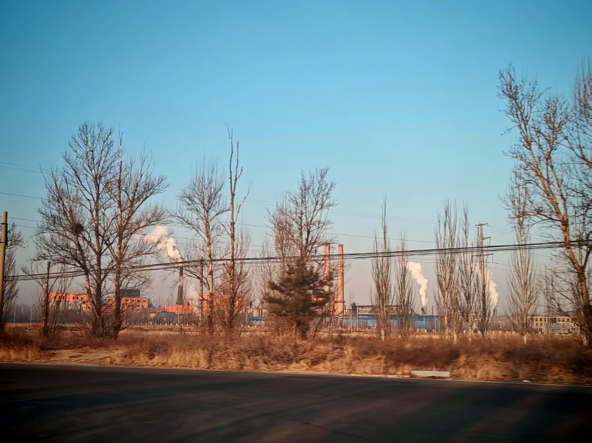

行至恒山附近，整座山脉褪去了葱郁的绿意，带着塞北特有的荒凉，灰褐色的山石间泛着淡淡的白色，像是冬日留下的印记，与我们此前爬过的东岳泰山、西岳华山等五岳都截然不同，少了几分秀丽，多了几分凛冽的壮阔与豪迈。山脚下的水库早已结了厚厚的冰，白茫茫的冰面在晨光下泛着细碎的微光，与远处苍茫的山脉相映成趣。
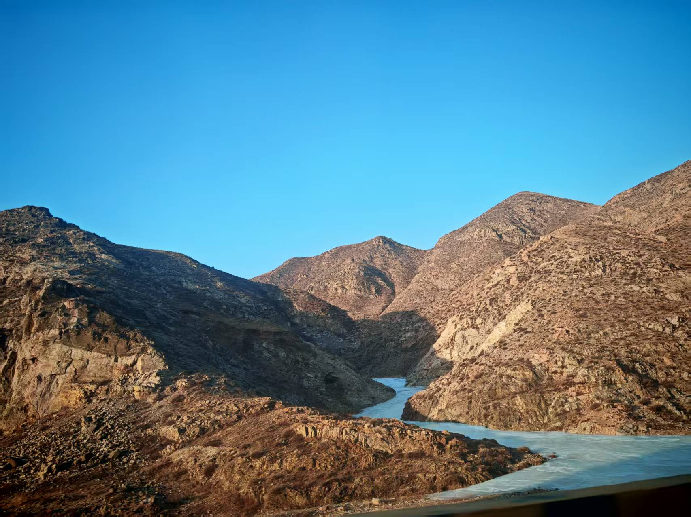

十点半左右从山门拾级而上，石阶缓得温柔，不像华山那般陡峭，也不似泰山那般拥挤，只有松柏夹道，山风卷着阳光从枝桠间漏下来，把身上的寒气一点点烘散。
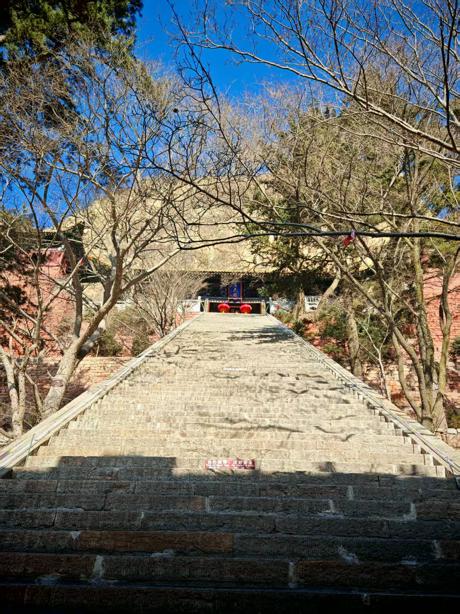

走了约莫一个钟头，便踩上了天峰岭的最后一段石阶，视野在每一步抬升里愈发开阔——脚下群山层叠成浪，头顶是洗得透亮的蓝，远处雪山泛着冷光，连呼吸都变得通透。出发前还在怕零下十几度的冻意，此刻早被汗意赶跑，围巾、外套都搭在臂弯，只剩满心的踏实。

站在山顶的那一刻，没有预想中的嘶吼与热泪，反倒像一场漫长的奔赴终于落了脚。从高考前攒下的五岳约定，到此刻并肩站在北岳之巅，那些攒了好几年的期待、奔波的疲惫，都在风里慢慢沉了下来，只剩一种 “终于交卷” 的平静。可转头看见好兄弟的笑脸，又突然涌起一股热意：我们真的把这趟少年时的约定，走完了。
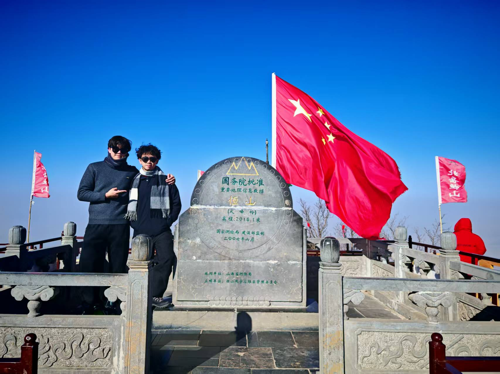

下山后，我们马不停蹄直奔悬空寺，远远望去，这座千年古建如明珠般嵌在陡峭的悬崖峭壁间，木质的楼阁层层叠叠，仅凭几根纤细的木柱支撑在绝壁之上，在山间静静伫立了千百年，虽因保护无法近距离登临，却依旧被这份巧夺天工的建筑智慧震撼到失语，千百年的历史底蕴，都藏在这悬崖之上的一砖一木里，藏在这独树一帜的建筑奇迹中。
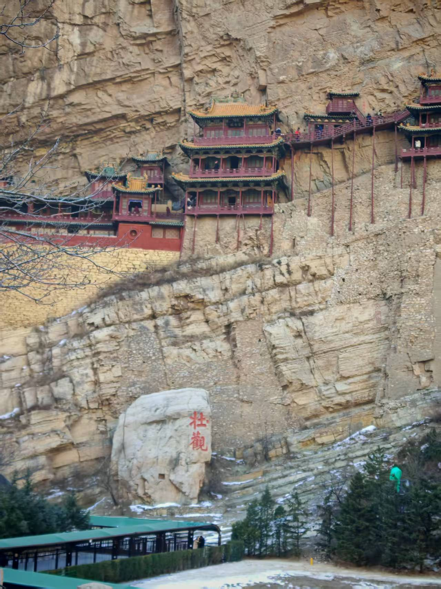

## 第二站：大同万龙滑雪场
爬完恒山虽不算疲惫，却也是一场酣畅淋漓的运动，本该就此休整，却还是抵不住冬日滑雪的诱惑，稍作休息后，傍晚便直奔大同万龙滑雪场——这是我人生第一次接触滑雪，心里满是紧张与期待。

滑雪场里热闹非凡，同行四人分成两队，两位好友挑战难度更高的单板，我和另一位好友选择了更好上手的双板，换上滑雪服、踩上滑雪板，瞬间感觉自己成了冬日里的勇士。跟着教练滑了一趟初级道，便慢慢摸清了滑雪的门道：脚摆成一个稳稳的八字形，外侧的雪板轻轻向上翘起，便是最基础的刹车动作，能稳稳控制滑行的速度；想再放慢些，就把八字打得更开，借着屈腿的动作轻轻调整身体重心，便能轻松实现转向，从一开始的小心翼翼、不敢迈步，到慢慢找到节奏、越滑越顺，成就感油然而生。
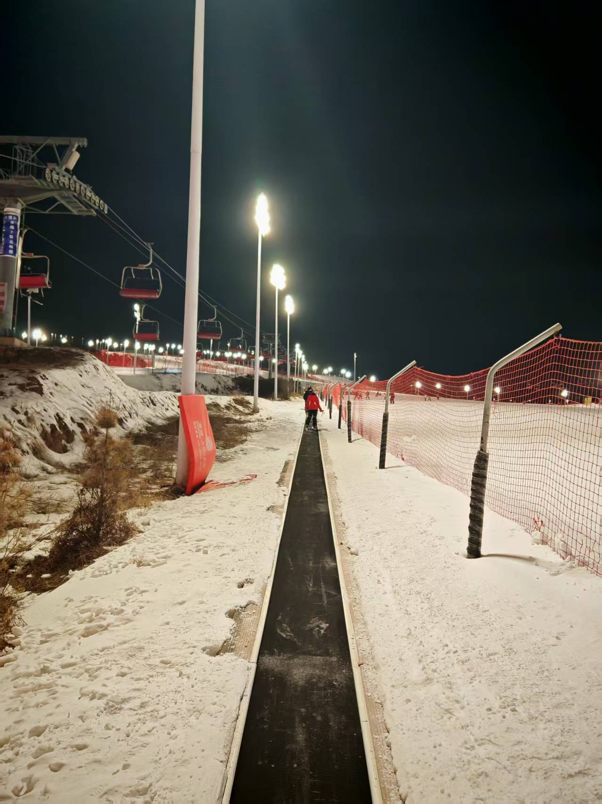

上初级道需要坐魔毯，四五分钟便能抵达起点，一遍遍滑行，慢慢熟悉技巧，胆子也越来越大。最后一次，我们索性挑战了中级道，坐着缆车抵达山顶时，寒风呼啸，冷到指尖发麻，却挡不住心头的兴奋。从山顶顺势滑下，风从耳边呼啸而过，雪板碾过雪地发出沙沙声响，速度与刺激交织，全程顺畅无比，一跤都没摔，这份圆满，成了冬日里最难忘的快乐。
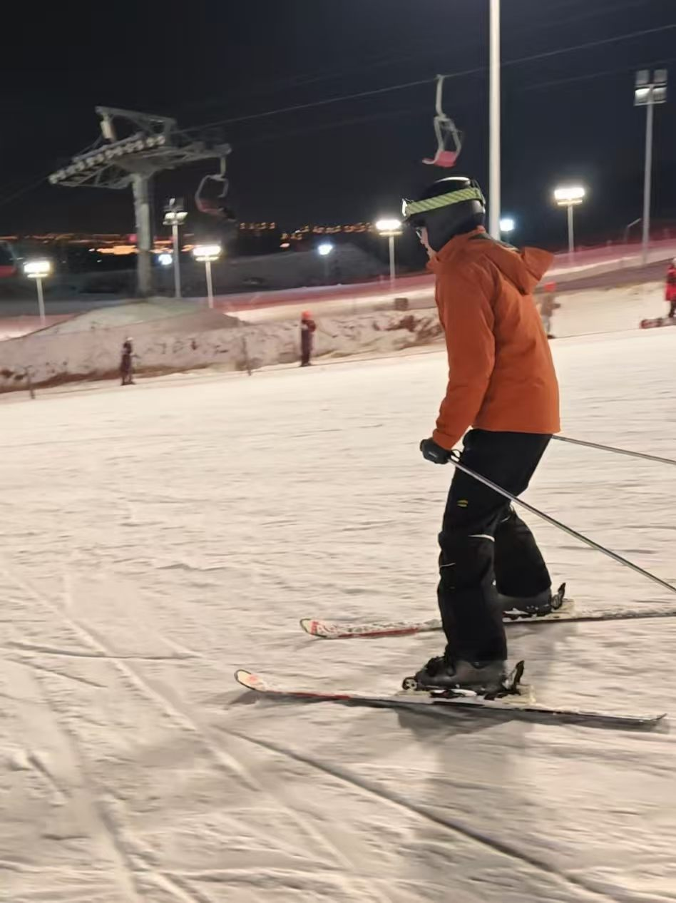

## 第三站：云冈石窟
次日一早，我们奔赴云冈石窟，直奔前二十窟打卡。走进石窟群，便真切感受到了千百年造像艺术的变迁与恢弘，从最初小巧精致的佛像，到后来巍峨高大的帝王造像，一尊尊石佛形态各异，藏着千百年的时光痕迹。
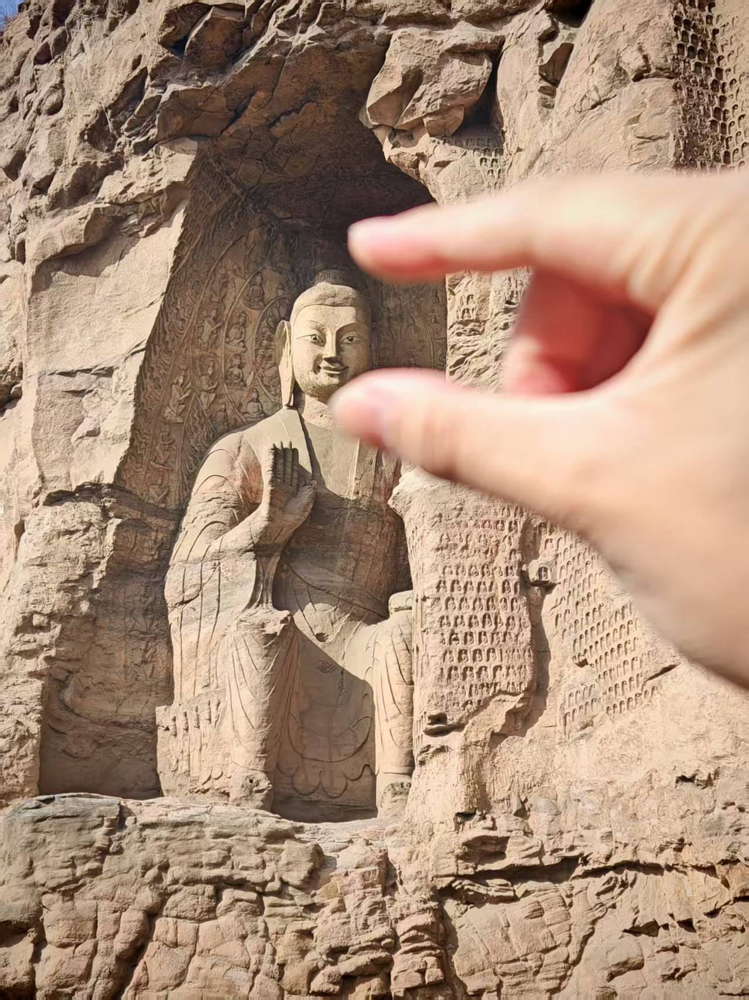

有的石窟内密密麻麻排布着无数小佛龛，方寸之间尽是精致的细节，每一尊小佛像都眉眼清晰、神态各异；有的佛像还保留着斑驳的彩色彩绘，虽经岁月磨洗，色彩早已不再鲜艳，却依旧能看出当年的精美，红、蓝、绿的色彩在石壁上晕开，为冰冷的石头添了几分温度。
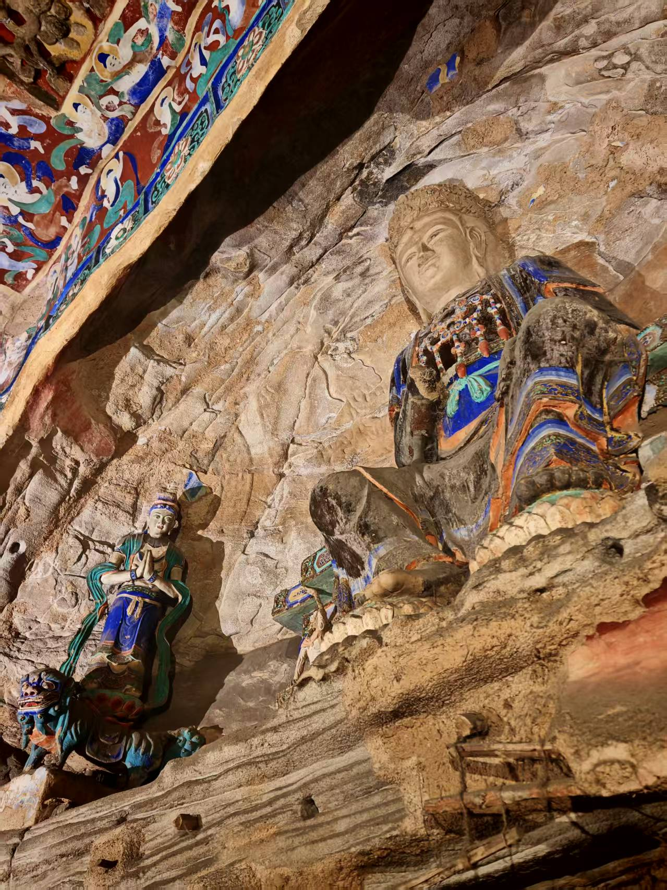

一尊尊石佛静静伫立在石窟中，眉眼间皆是慈悲与平和，石窟的石壁上，刻满了岁月的纹路，站在佛窟前，周遭安静得能听见心跳，只觉心头发颤，被这份跨越千年的壮阔与虔诚深深打动。

## 第四站：大同古城
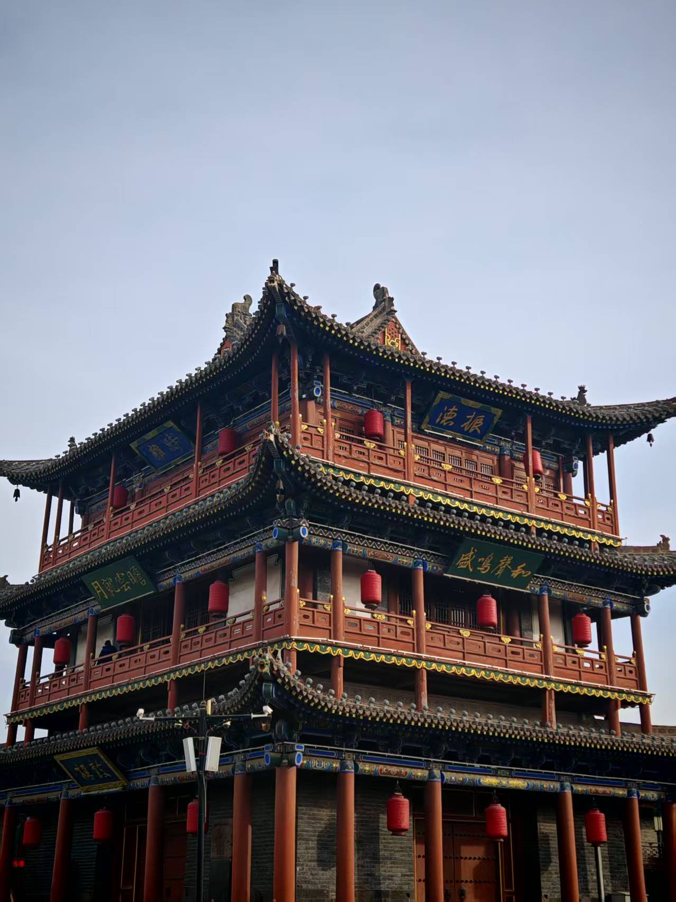
逛完石窟，中午便走进大同古城，在街巷间寻一家本地餐馆，解锁地道的大同美味。莜面栲栳栳是必点的特色，筋道的莜面卷裹着浓郁的汤汁，一口下去满是杂粮的醇香；刀削面口感筋道，汤底浓郁，配着劲道的面条，暖胃又饱腹；黄花烩菜鲜香味浓，黄花的清甜融合着配菜的醇厚，滋味独特；还有羊肉、牛肉烧麦，皮薄馅大，咬开一口，汤汁鲜香，肉馅扎实，每一口都是地道的塞北风味。
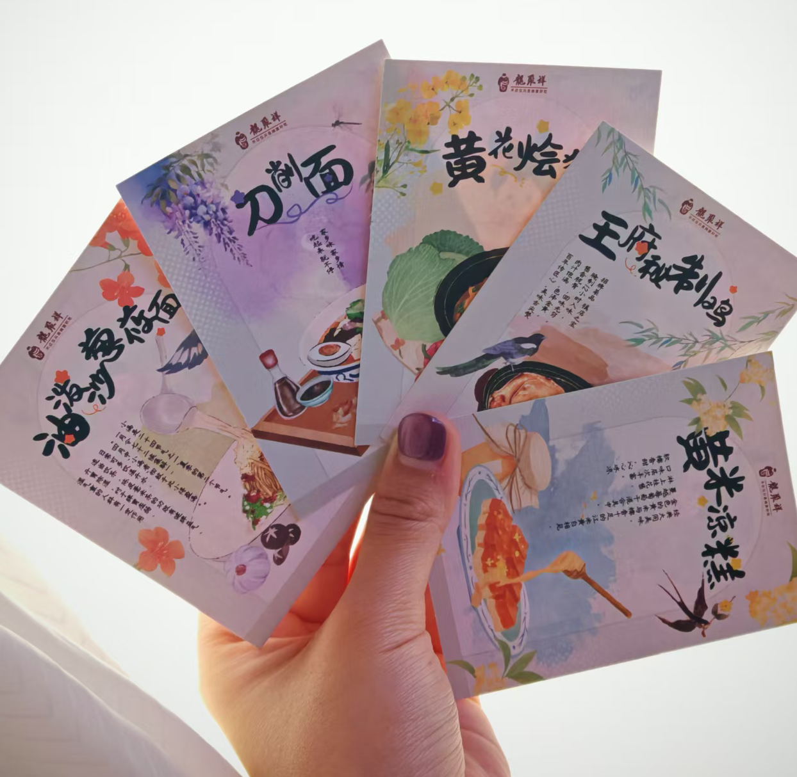

逛古城的路上，偶遇了大同特色的沙棘汁，酸甜爽口，解腻又开胃，还尝了沙棘味冰淇淋，酸酸甜甜的口感在舌尖化开，奇妙又美味，是独属于北方的酸甜滋味。

更惊喜的是，路上遇见一对情侣牵着阿拉斯加，还有一位大哥牵着一只小狐狸，毛茸茸的小家伙们格外可爱。
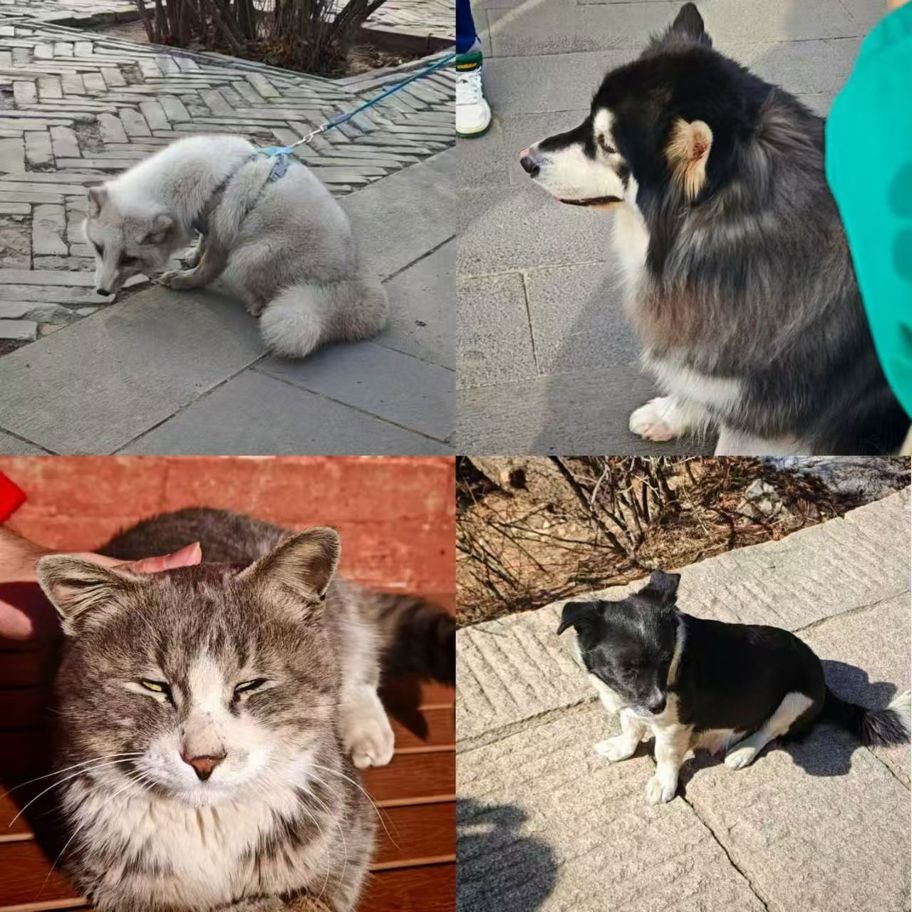

---

# 第二部分：太原——古建寻踪，省博探宝，晋味绵长

告别大同的塞北壮阔，当晚我们便奔赴太原。车子驶入市区时，夜色已深，这座古城褪去了白日的喧嚣，只剩路灯暖黄的光，把街巷晕染得温柔又沉静。

骑着共享单车钻进一家本地家宴馆，一扫赶路的疲惫。豆笋是意外之喜，劲道的豆皮卷口感Q弹，鲜香味浓；剔尖是山西特色面食，口感筋道，就着码子，滋味醇厚；糖醋丸子酸甜适口，外酥里嫩；还吃到了不一样的莜面栲栳栳，将原本的六边形莜面切开翻炒，吸饱了酱汁，味道更加浓郁。
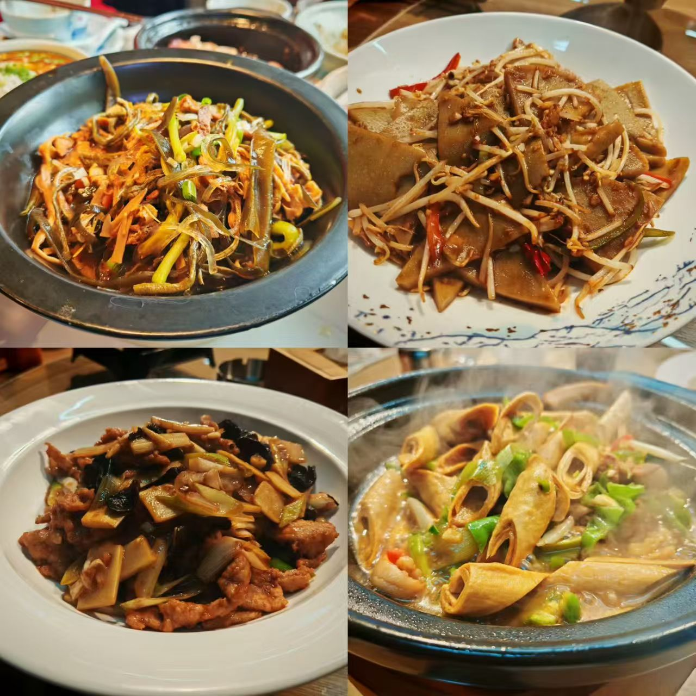

## 第五站：山西博物院
次日一早，我们直奔山西博物院，刚到门口，便被独特的建筑外形吸引：整体是倒着的方台造型，四面呈梯形，线条简洁大气，与河南博物院的“削顶金字塔”造型恰好相反，一正一反，各有韵味，光是建筑，便让人忍不住惊叹。
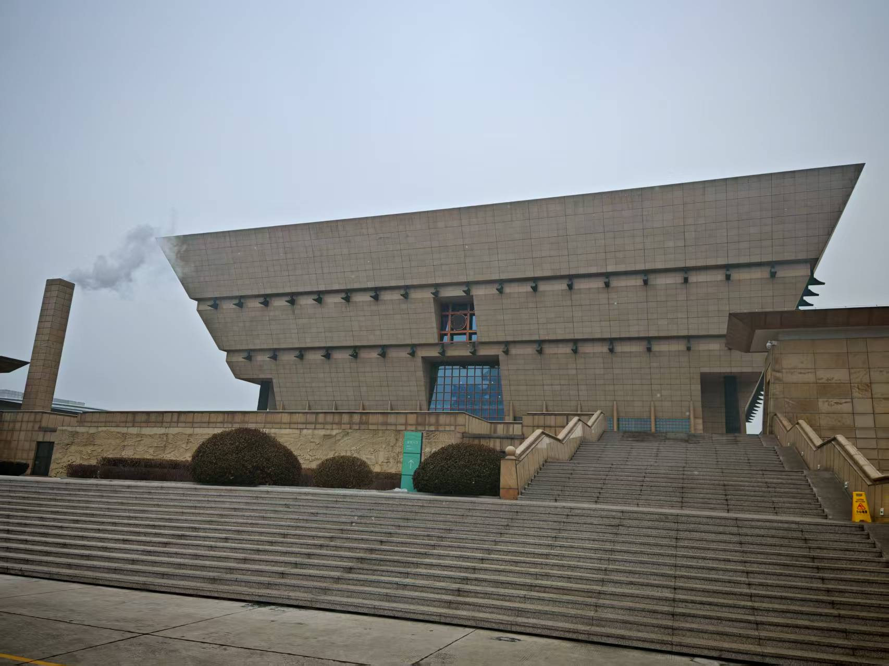

速通博物院，馆藏文物琳琅满目，从三晋古物到千年珍宝，每一件都藏着岁月的故事。见到了非常可爱的鸮卣，精巧的造型，细腻的纹路，鸟儿的形态栩栩如生，细节处尽是古人的匠心，静静伫立在展柜中，自带千年的韵味。
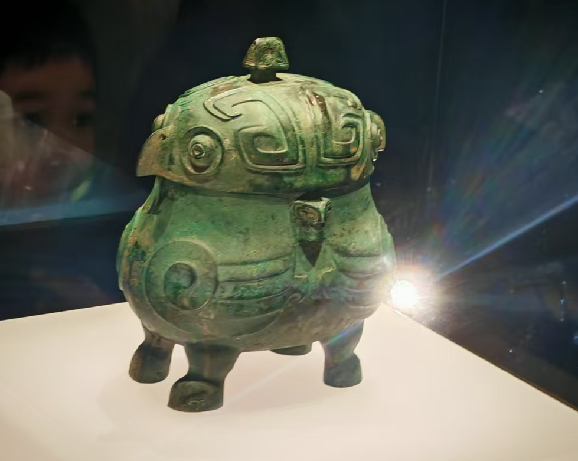

## 第六站：晋祠
从博物院出来，我们往晋祠赶去。冬日的晋祠带着淡淡的清冷，却丝毫不减古建的韵味。园内的亭台楼阁错落排布，飞檐翘角上的脊兽造型精美，虽经岁月，却依旧生动，木雕、石雕、砖雕细节满满，每一处都藏着古建的精巧，走在其间，仿佛踏入了一座千年古建博物馆，一步一景，皆是风情。
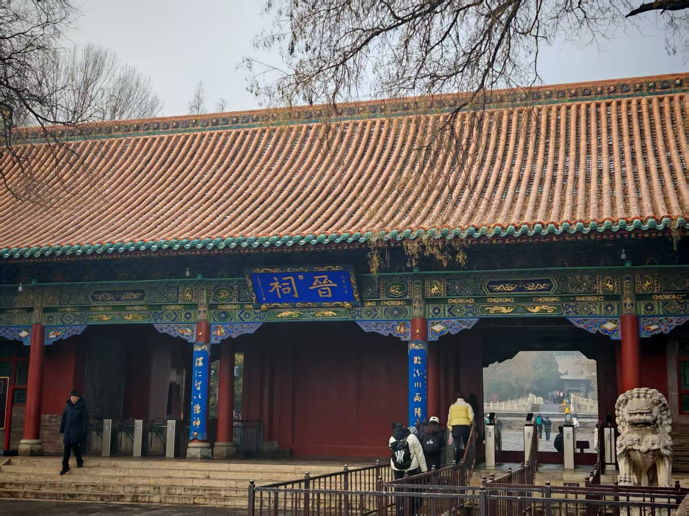
（都是在山西，晋祠都是5A级景区，五岳里也只有恒山是4A了。。。）

刚到晋祠门口，便被街边的冰糖葫芦吸引，买上一串，酸甜的山楂裹着晶莹的糖衣，咬一口嘎嘣脆，酸甜适口，直呼是“人生中最好吃的冰糖葫芦”。

走进晋祠园内，偶遇了一只格外粘人的小猫，围着我们四人打转，我们把它围在中间，它便从一个人的脚边绕场一周撒娇，萌之萌之。更巧的是，快出园时，遇见了这只小猫的“双胞胎兄弟”，只远远蹲在假山下看着我们，模样长得几乎一模一样，却格外高冷，不粘人也不撒娇。

---

# 尾声
从晋祠的古建余晖里转身，这场山西之行也落了帷幕。傍晚我们踏上了返程的飞机，抵达深圳时已是凌晨。这场跨越四城的旅行，从北京的红墙黄瓦，到天津的洋楼烟火，再到大同的塞北壮阔，最后到太原的古建绵长，一路走走停停，看遍不同的城市风光，尝尽各地的地道美味。

这一路，有奔波的疲惫，有初见美景的惊叹，有吃到美食的欢喜，更有和好友相伴的温暖。四人相聚在一起，看遍山川湖海、古建烟火，把平凡的日子过成了闪闪发光的回忆。那些一起走过的路、一起说过的话、一起定格的合照，都成了心底最珍贵的收藏。

我在恒山的山巅和好兄弟说，我一定要做一个像「旅行家说」这样的博客。我想把路上的风景、心底的欢喜，都细细记录下来，把那些与挚友相伴的美好、与世界相遇的惊喜，变成可看、可感、可回味的文字。而这场跨越山海的旅行，正是对这份初衷最好的诠释 —— 旅行从不是独自的奔赴，而是与同频的人一起，把时光走成风景，把相遇写成故事。

把这篇游记写给我自己，也写给一路同行的你们。愿我们永远记得这一路的欢声笑语，永远保持对世界的好奇，下次，再一起奔赴下一场山海，再一起把更多美好，写进岁月里。

（撰稿：2026/3/24）