一场说走就走的旅行，往往最动人。1月13日结束期末考试，等好友15日考完收尾，我们当天下午便拎起行囊，踏上了前去江西的高铁。没有周密的行程，没有严苛的打卡，只定下了南昌、景德镇两座城市，剩下的行程走一天、安排一天。

## 南昌：豫章故郡，洪都新府
傍晚抵达南昌，城市已经慢慢入夜。

我们的酒店恰好定在滕王阁旁，在万寿宫站下地铁，步行就能抵达。夜色中的滕王阁，暖亮的灯光洒在建筑上，勾勒出古阁的雅致轮廓。
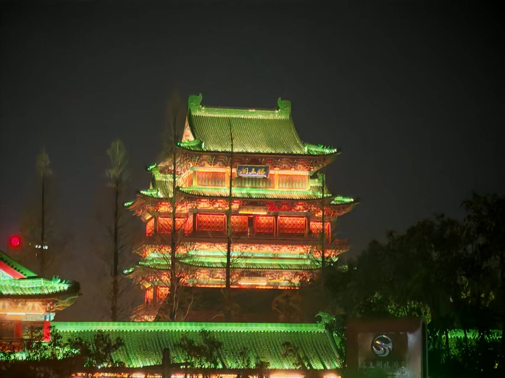

酒店楼下就是一条老步行街，入夜后依旧热闹，我们骑着共享小电驴，穿梭在南昌的街巷里。街道宽敞，晚风微凉，一切都安静又舒展。

来自江西的室友推荐我们去吃水煮，江西特色小吃，像极了升级版的关东煮，各类食材很有风味，汤汁浓郁鲜香。

次日，我们在街边的老店吃早餐。这座城市的物价格外亲民，一碗拌粉不过三四块钱，瓦罐汤便宜的三四元，贵的也只需六七块，两个人花上十来块，就能吃到饱腹又满足。
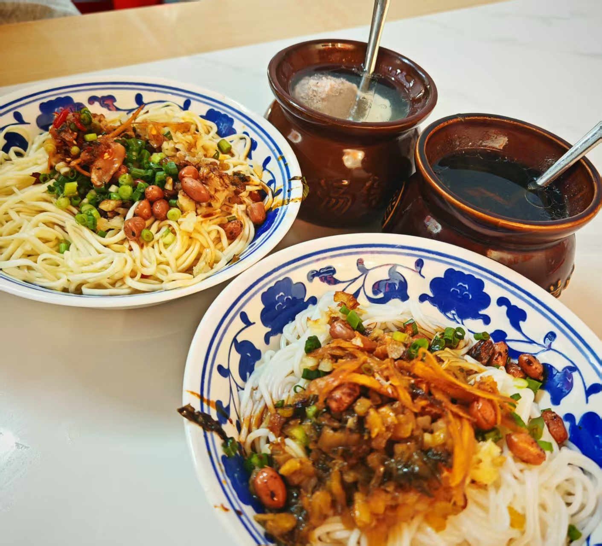

滕王阁旁的老街区里有很多这样的小店，低矮的红瓦房错落有致，满是复古风情，烟火气十足。
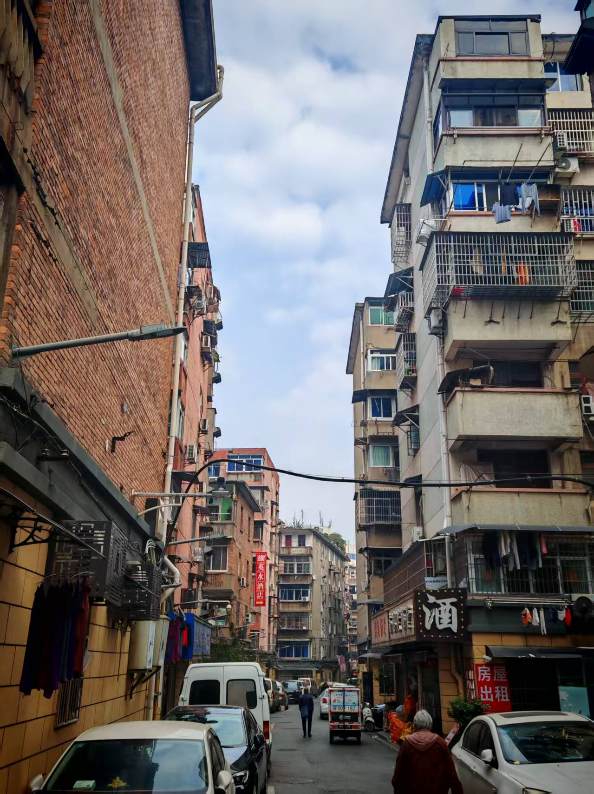

吃饱喝足，我们前往江西省博物馆。一件件文物静静陈列，从远古到近代，江西的文脉与历史在眼前缓缓铺开，看得人心静又感慨。也有很多现代的艺术作品，还打卡了薛之谦专辑封面同款瓷像。
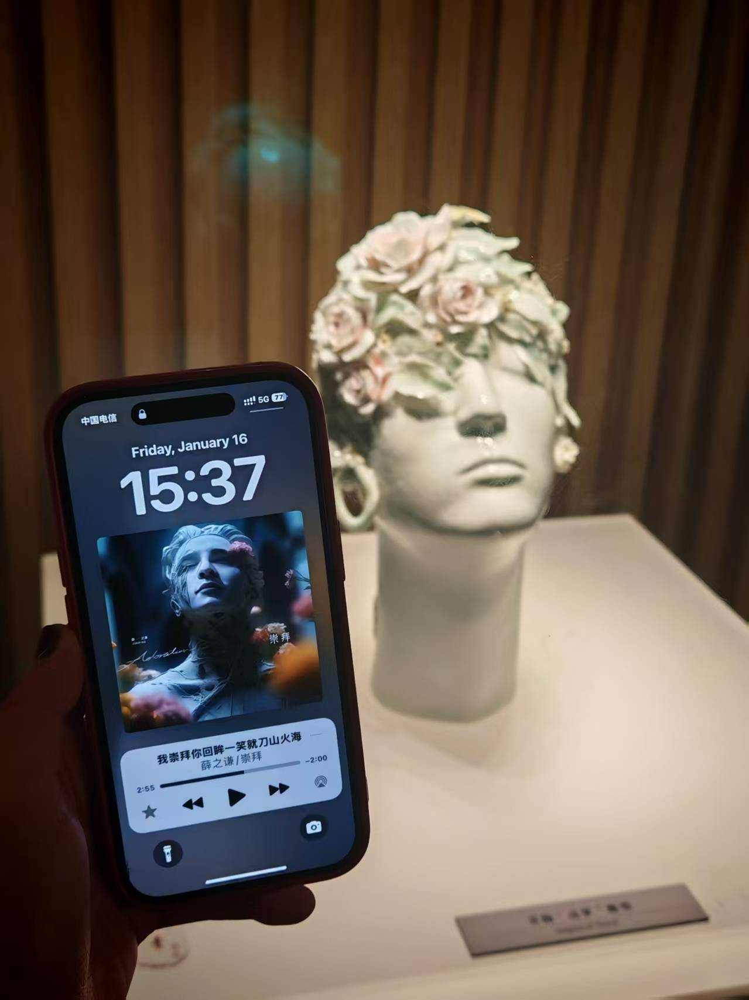

傍晚时分，我们来到南昌之星摩天轮。天色还亮着，夕阳把天空染得柔和，巨大的轮体静静矗立在城市里，显得格外醒目。
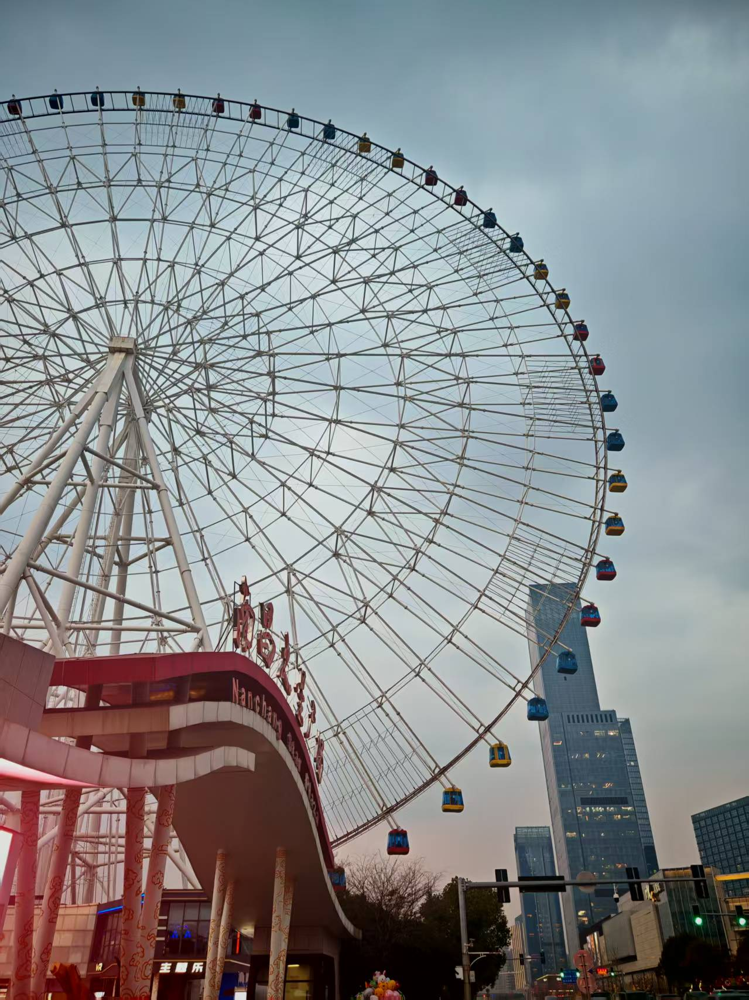

我们在旁边的商场简单吃了晚饭，再出来时，夜色已经悄悄笼罩了整座城。摩天轮缓缓亮起暖光，一圈圈光晕在夜空里格外温柔浪漫，和城市灯火交相辉映，美得让人挪不开眼。

随后前往八一广场。广场开阔平整，中央的纪念塔笔直矗立，通体庄重，透着一股沉稳的气势，让人不自觉心生敬意。
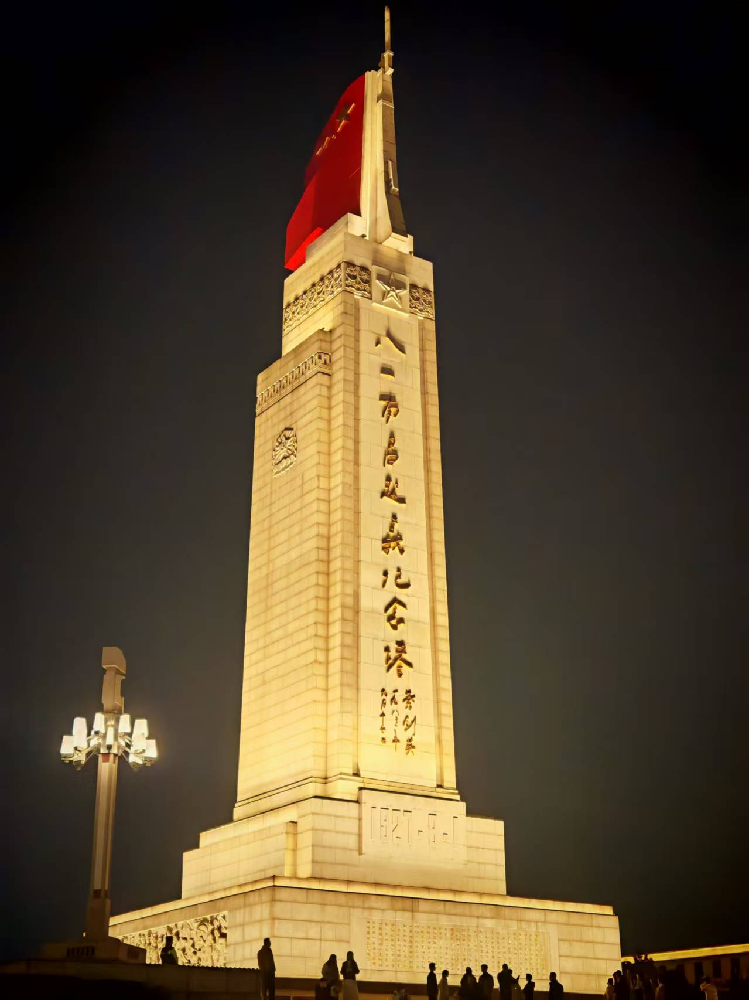

广场对面的美术馆，建筑线条利落，外观简约大方，没有花哨的装饰，却透着沉静的艺术质感。

回酒店正好是在万寿宫站下车，这是一个历史文化街区。这里既有青砖黛瓦的古朴民居，也有气势庄重、酷似宫殿形制的古建筑，传统古韵十足。街区还连着现代步行街，小吃香气四溢，人声热闹却不嘈杂。
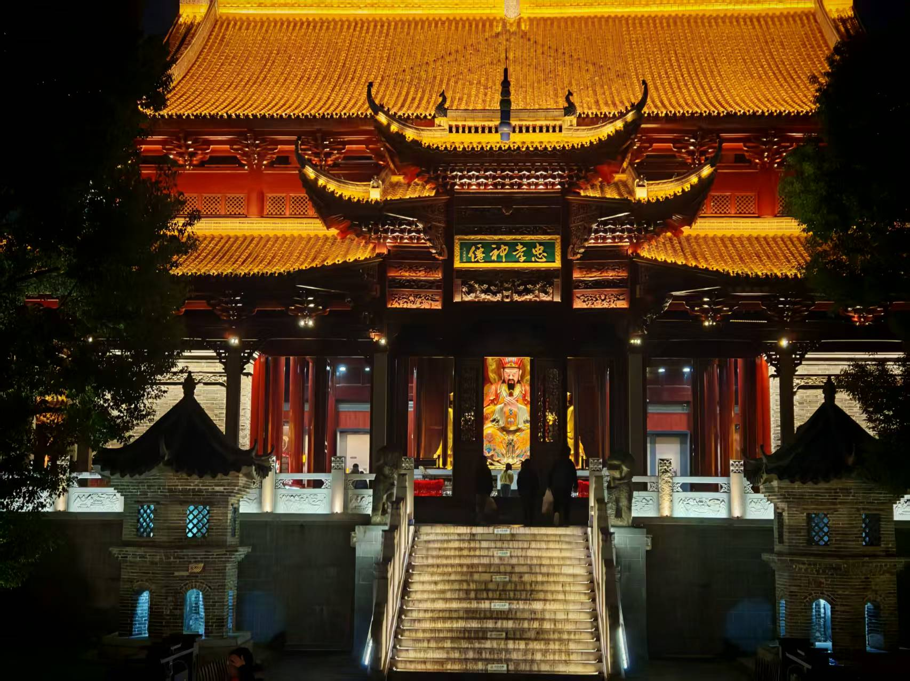

第三天上午，我们终于走进滕王阁。
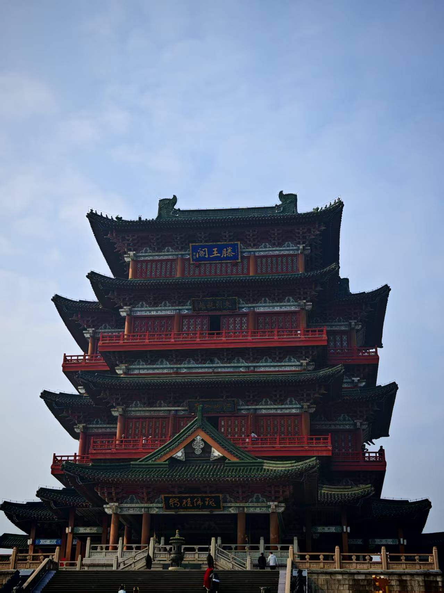

登楼远眺，江水悠悠，楼宇层叠，“落霞与孤鹜齐飞”的意境虽未全见，却也能体会到古人登临时的心境，历史的厚重与江风一起扑面而来。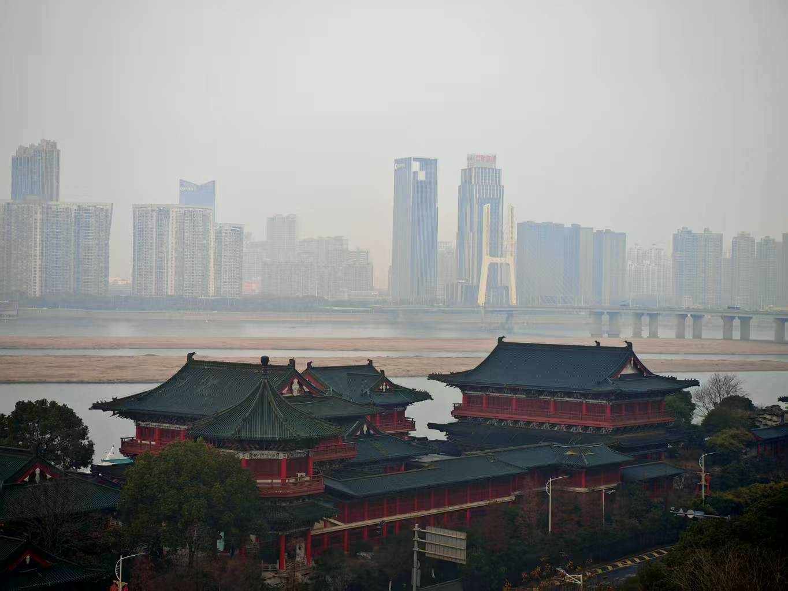

下午便离开南昌，前往景德镇。从一座城到另一座城，从厚重历史，转向瓷都的温柔诗意。

---

## 景德镇：瓷镇千年，釉色人间
抵达景德镇已是晚上，第一站直奔陶溪川文创街区。这里是专属陶瓷的艺术天地，整体是红墙复古建筑，既有老工业区的硬朗质感，又有美术馆的文艺氛围，随处都透着浓郁的艺术气息。
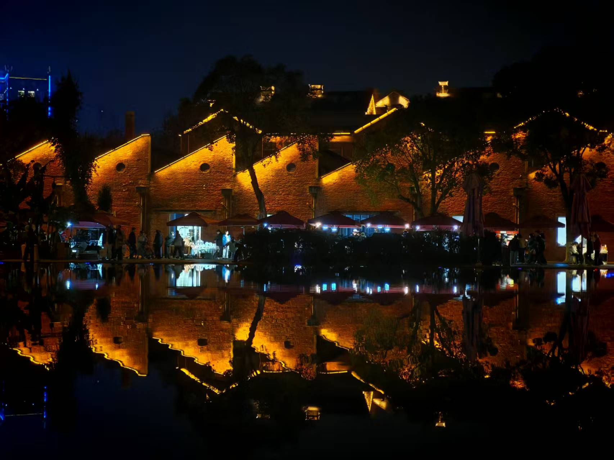

每个摊位的瓷器风格都独具特色，有上釉精致的摆件，有素净古朴的素坯，各类主题应有尽有。瓷制的钟表、贝壳造型的装饰、各式杯盏、花瓶数不胜数，每一件都饱含匠心。这里年轻人居多，创意满满，逛上许久都不会觉得乏味。

第二日白天，前往陶阳新村。这里是热闹的陶瓷集市，满街都是瓷器摊位，接地气又好逛。瓷花、小摆件、花瓶、杯碗应有尽有，款式繁多，价格也实惠亲民，很适合慢慢挑选。
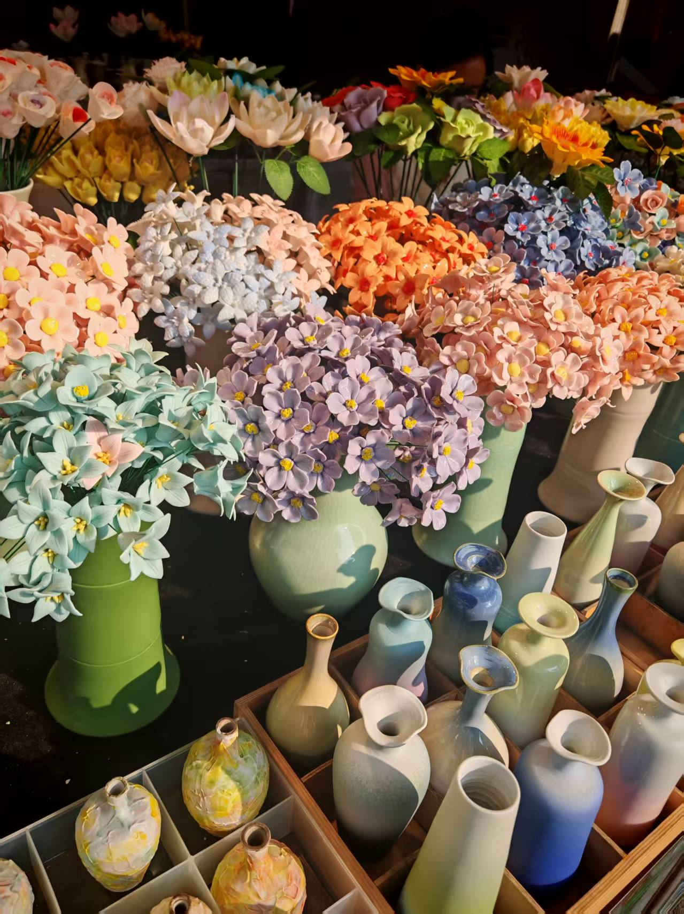

我逛了许久，挑了三个瓷花瓶，又搭了不少瓷花和小摆件，非常合我心意。
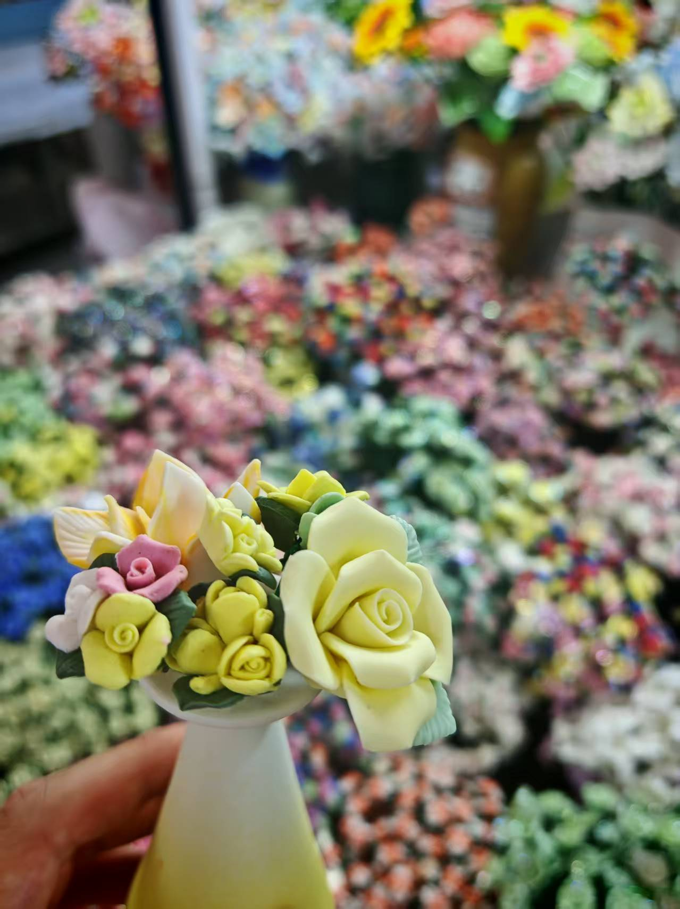

在景德镇的时光，慢且治愈，整座城市都透着温润的质感，像是满城都飘着瓷土的清香。

---

## 尾声
1月19日，踏上返回深圳的路程。

从南昌的市井烟火，到景德镇的瓷韵温柔，这场江西之行短暂却格外充实。

没有紧凑的行程，没有匆忙的赶路，和好友一起，慢悠悠逛老城、尝小吃、赏古建、淘瓷器，把期末的疲惫全都吹散。比起刻意打卡景点，这份随性自在的慢时光，更让人觉得珍贵难忘。

（撰稿：2026/3/24）

