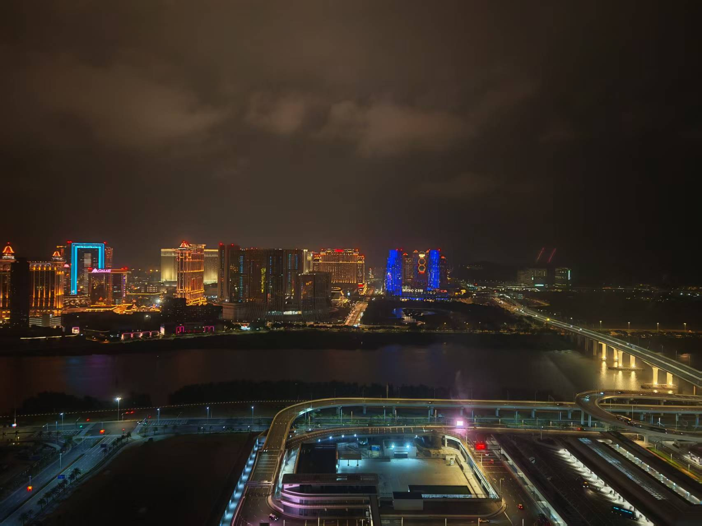
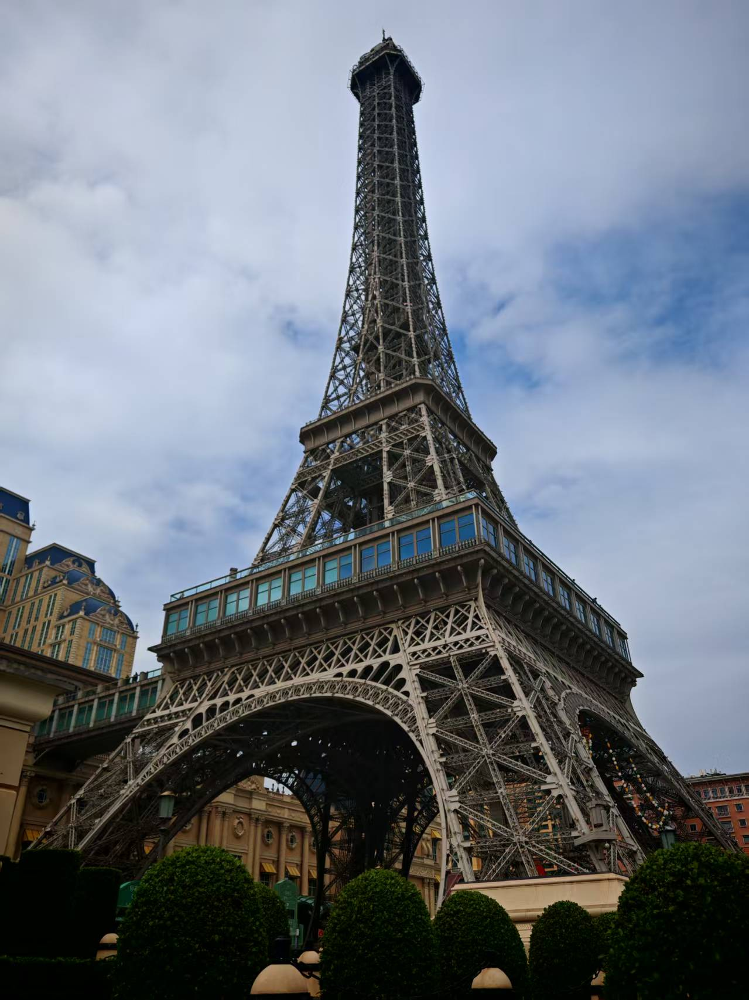
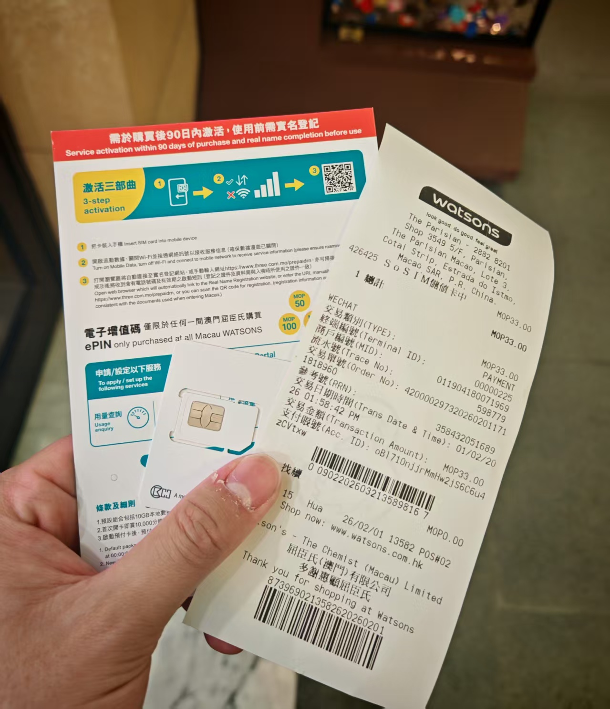
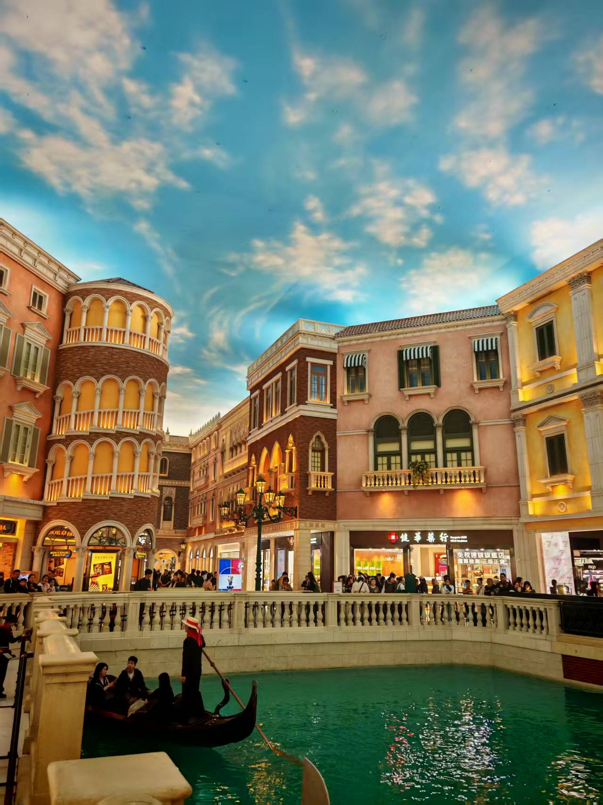
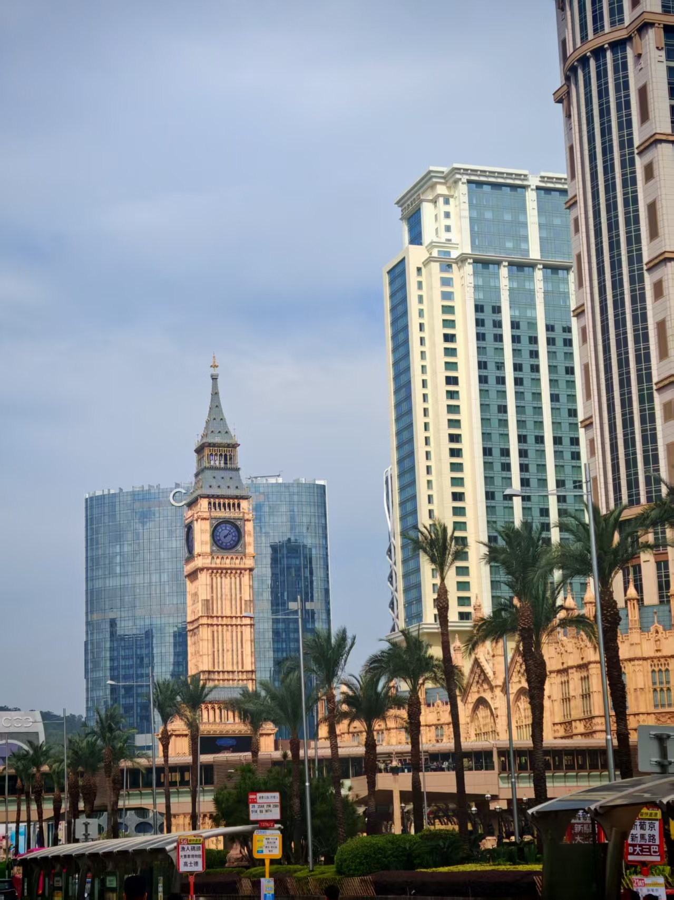
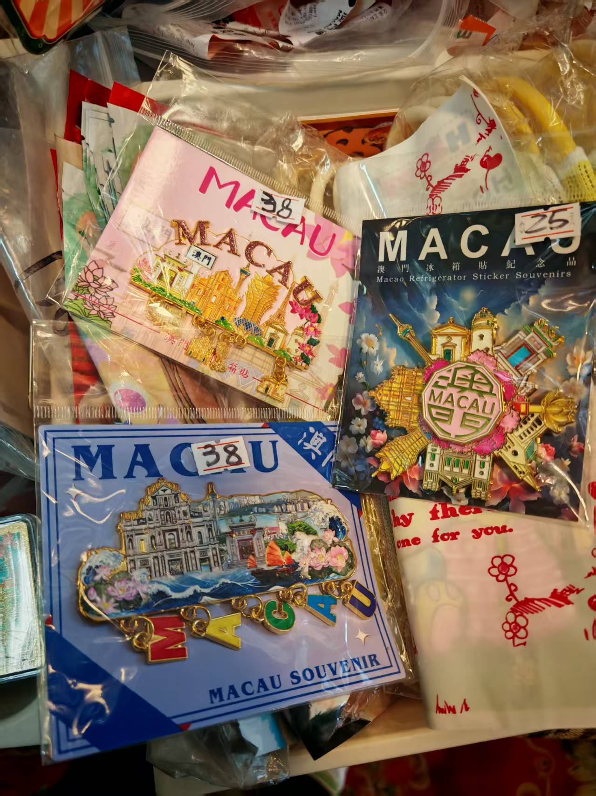
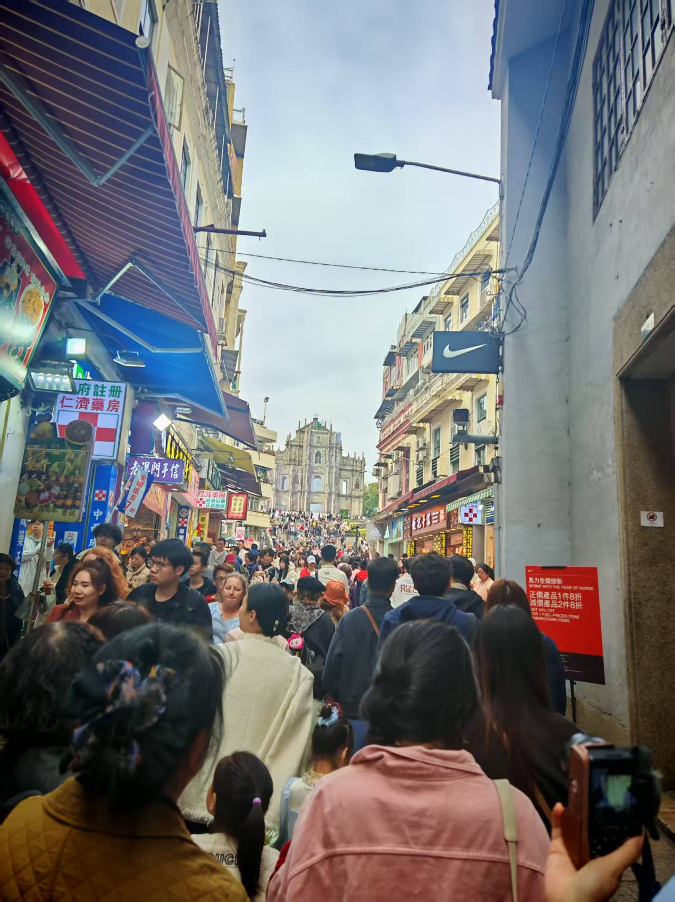
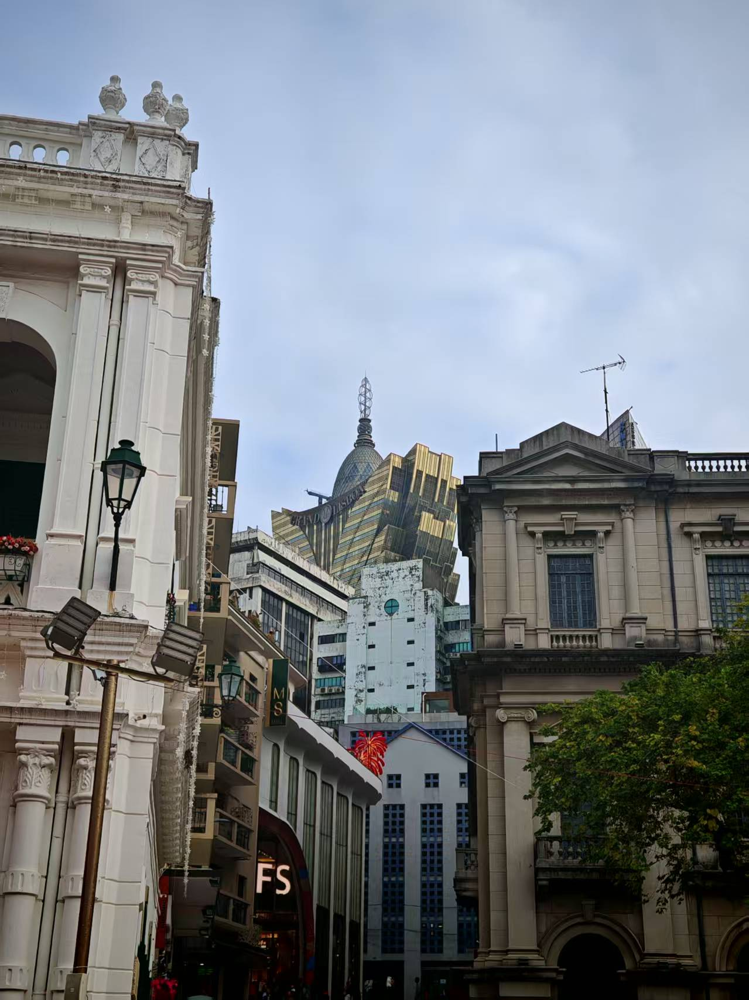
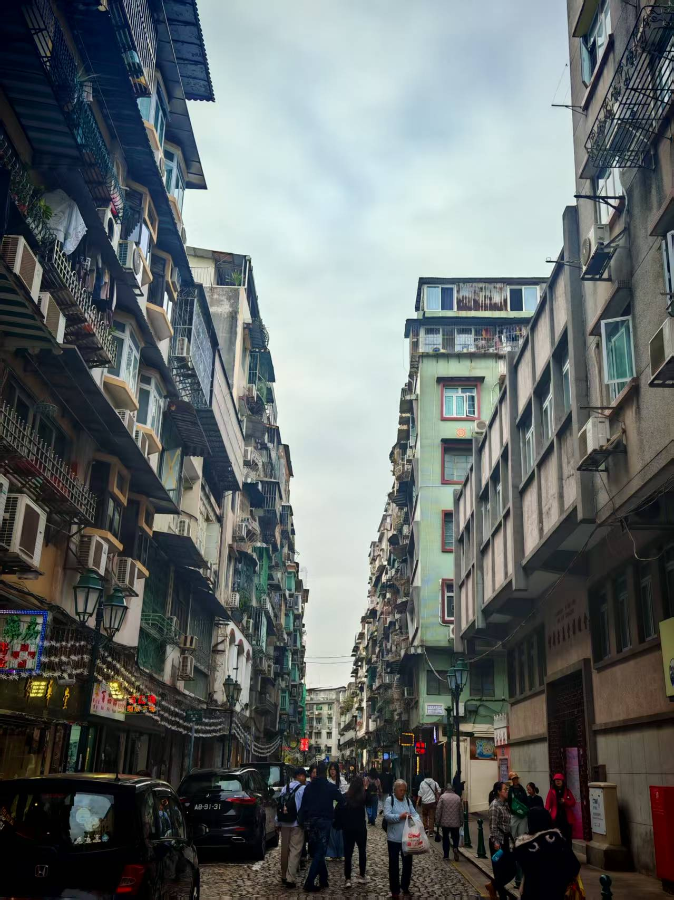

2月1号晚上，住在珠海横琴，就在口岸的正上方。站在窗边就能一眼望到对面的澳门，夜色一落，整片城市瞬间亮起，高楼灯火连绵成片，霓虹与江面倒影交织在一起，明明只隔了一道关口，却像站在两个世界的边缘。这种近在咫尺又遥遥相望的感觉，很奇妙。

第二日一早过关，刚入境就出了点小意外：提前买的海外流量包没生效，手机直接断了网，一下子有点慌。只好跟着人流坐上发财车，先到澳门银河那边，再慢慢想办法。

一路晃到澳门巴黎人，终于在里面的屈臣氏买到了临时流量卡。插上卡连上网络的那一刻，才算真正踏实下来，能好好逛这座城了。

接下来走进威尼斯人，商场之大真的超出想象。头顶是整片人造天空，走廊四通八达，走着走着就分不清东南西北，绕了好几圈才勉强走出来，算是实实在在地“迷路”了一次。

沿路还经过了永利皇宫和伦敦人，几座建筑风格截然不同，欧式奢华扑面而来，一眼望去全是精致气派的现代都市感。

之后坐大巴前往大三巴。下车后在路边小店看到两个很精致的冰箱贴，样式很好看，直接买了下来，算是这次旅行的小纪念。

可真到了大三巴才发现，人多到几乎寸步难行，挤在人群里慢慢挪动。加上牌坊部分区域还在装修，没能看到完整的样貌，多少有点可惜。但站在那座历经岁月的石质建筑前，历史的厚重感依旧扑面而来。

从大三巴慢慢走到新葡京，现代赌场的耀眼灯光与周围老街的低矮楼房挨在一起，强烈的对比格外震撼。古老街巷与奢华都市并肩而立，这大概就是澳门最独特的魅力。

傍晚坐大巴返回口岸，一天的澳门之行匆匆结束。

澳门给我的感觉，就是历史和现代的极致碰撞。两个岛风格完全不同：氹仔满是奢华的酒店、商场，像一个精致的梦境；而澳门本岛，是老街、牌坊、烟火气，藏着这座城市的根。它不是非此即彼，而是两种生活方式、两种时代印记，在同一个空间里共生。

这种碰撞，就是澳门最独特的地方。短短一天，却足够让人记住很久。

（撰稿：2026/3/23）